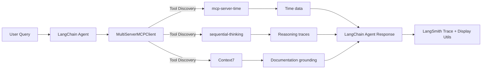

# LangChain MCP Integration: From Tool Chaos to Context Clarity

> **Built on examples from the [LangChain MCP Adapter](https://github.com/langchain-ai/langchain-mcp-adapters) repository**

## TL;DR

This project demonstrates how LangChain agents automatically discover and orchestrate tools from multiple MCP servers (time, reasoning, documentation). The breakthrough: **Context7**—a documentation retrieval system that grounds agent responses in real, versioned docs from 40+ libraries (LangChain, LangGraph, OpenAI, Next.js, Redis, etc.), eliminating hallucination.

**Quick Start:** `python clients/integration_test_mcp_json.py` | **Live Example:** [LangSmith Trace](https://smith.langchain.com/public/be69829b-ae12-4d0d-a735-ce53853d1b45/r)

## Stack at a Glance

```bash
LangChain 1.0.2 | MCP SDK ≥1.6.0 | FastMCP | Context7 | LangSmith | Python ≥3.13
Transport: stdio, HTTP (streamable-http), SSE | LLM: OpenAI GPT-4.1
```

---

## 🧩 The Problem

AI engineers face a persistent challenge: integrating tools from diverse sources—Python, Node.js, different transports, varying API patterns—into unified agent frameworks. Traditional approaches create vendor lock-in, brittle integrations, and hallucination-prone reasoning.

**What if there was a better way?**

This project demonstrates a **protocol-based approach** where the [Model Context Protocol (MCP)](https://modelcontextprotocol.io/) serves as the universal adapter, enabling agents to:
- **Discover tools automatically** from heterogeneous services
- **Ground responses in real documentation** (not hallucinations)
- **Reason transparently** with observable decision paths

This isn't just about connecting APIs—it's about building **composable agent ecosystems** where context, not just reasoning, drives intelligence.

---

## 🏗️ System Overview

The architecture follows a clean separation of concerns:



### MCP Server Roles

| Server | Purpose | Example Tools |
|--------|---------|---------------|
| **mcp-server-time** | Temporal reasoning and timezone operations | `get_current_time`, `convert_time` |
| **sequential-thinking** | Logical scaffolding for stepwise reasoning | `sequentialthinking`, `plan_steps` |
| **Context7** | **Documentation grounding** — retrieves real docs from LangChain, LangGraph, MCP, and 40+ other libraries | `resolve-library-id`, `get-library-docs` |

> 💡 **Why Context7?**
>
> Context7 expands far beyond LangChain—it surfaces authoritative documentation from **40+ ecosystems** including OpenAI SDKs, Next.js, Redis, Supabase, Hugging Face, and more. This makes it a universal grounding layer for factual AI responses, not just a tool adapter.

All tools are **auto-discovered** via the MCP protocol and exposed to the agent as a unified toolkit.

---

## 💡 Why This Matters

This architecture demonstrates three critical pillars for production-grade agentic systems:

### 1. Standardization (MCP Protocol)
- **Decouples agents from tool implementation** — no vendor lock-in
- **Language-agnostic** — Python, Node.js, or any runtime
- **Transport-agnostic** — stdio, HTTP, SSE, or WebSocket

### 2. Grounding (Context7)
- **Factual correctness** via authoritative documentation retrieval
- **Source attribution** — every answer links back to verified docs
- **Version awareness** — query specific library versions (e.g., `/langchain/langchain/1.0.2`)

### 3. Observability (LangSmith)
- **Visible reasoning paths** — see every tool call and decision
- **Debuggable execution** — trace failures to root cause
- **Performance metrics** — token usage, latency, tool selection

> ⚡ **Key Takeaway:** MCP transforms tool integration from code wiring to protocol negotiation. Context7 ensures agents learn from truth, not hallucination.

**Together, these pillars enable agents that are scalable, truthful, and auditable.**

---

## 🚀 Demo Highlights

The centerpiece of this project is [**`integration_test_mcp_json.py`**](clients/integration_test_mcp_json.py)—**112 lines** that demonstrate the full power of MCP integration.

> 🧩 **Insight:** This isn't just tool orchestration—it's **protocol-based context architecture**. The agent reasons *with* documentation, not just *about* tasks.

### What It Does

1. **Spawns three MCP servers** (time, sequential thinking, Context7) as subprocesses
2. **Discovers tools** from all servers via `MultiServerMCPClient`
3. **Creates a LangChain agent** with the aggregated toolkit
4. **Executes a complex query**: *"Provide migration guidance from LangGraph's `create_react_agent` to LangChain's `create_agent` (v1.0.2)"*
5. **Grounds the response** in Context7 documentation—no hallucination

### Live Example

See the [LangSmith trace](https://smith.langchain.com/public/be69829b-ae12-4d0d-a735-ce53853d1b45/r) for the full execution, or review the [detailed output](docs/integration_test_mcp_json.md).

### At a Glance

| Aspect | Details |
|--------|---------|
| **Script** | [`integration_test_mcp_json.py`](clients/integration_test_mcp_json.py) (112 lines) |
| **Servers** | Time, Sequential Thinking, Context7 (auto-spawned) |
| **Query** | "Migrate from LangGraph `create_react_agent` to LangChain `create_agent`" |
| **Result** | Documentation-grounded migration guide with source attribution |
| **Trace** | [LangSmith](https://smith.langchain.com/public/be69829b-ae12-4d0d-a735-ce53853d1b45/r) |

**Key Takeaway:** The agent doesn't just *reason*—it **learns from truth**. Context7 surfaces code snippets, API references, and migration guides directly from LangChain's official docs.

### Migration in Action

The script demonstrates the shift from LangGraph to LangChain v1:

```python
# Old (LangGraph)
from langgraph.prebuilt import create_react_agent
agent = create_react_agent(model, tools, prompt=...)

# New (LangChain v1.0.2+)
from langchain.agents import create_agent
agent = create_agent(llm, tools=tools, prompt=...)
```

This isn't a toy example—it's **production-ready** agent orchestration with **real documentation grounding**.

---

## ⚙️ Quick Start

### Prerequisites

```bash
# Install dependencies
uv venv --python 3.13
source .venv/bin/activate
uv pip install -e .

# Set environment variables
cp .env.example .env
# Add your OPENAI_API_KEY, LANGSMITH_API_KEY (optional), CALCOM_API_KEY (optional)
```

### Option 1: Run the Integration Test (Recommended)

The simplest way to see everything in action:

```bash
python clients/integration_test_mcp_json.py
```

This automatically spawns all required MCP servers, discovers tools, and demonstrates Context7-grounded reasoning.

### Option 2: Manual Server Setup

For exploration and development, start servers manually:

**Terminal 1 - Weather Server (port 8000):**
```bash
python servers/weather_server.py
```

**Terminal 2 - LangChain Math Tools Server (port 8001):**
```bash
python servers/wrap_langchain_tools_server.py --port 8001
```

**Terminal 3 - Client (Jupyter Notebook):**
```bash
jupyter notebook clients/langchain_mcp_adapter_client.ipynb
```

---

## 🔧 Server Configuration

### Custom HTTP Servers

#### `weather_server.py`

Simple weather MCP server using FastMCP (HTTP transport).

**Port:** 8000 (default) | **Tool:** `get_weather` (mock data)

```bash
# Default
python servers/weather_server.py

# Custom port
python servers/weather_server.py --port 8080
```

#### `wrap_langchain_tools_server.py`

Converts LangChain tools to MCP format.

**Port:** 8001 (default) | **Tools:** `add`, `multiply` | **Pattern:** LangChain → MCP adapter

```bash
# Default
python servers/wrap_langchain_tools_server.py

# Custom port
python servers/wrap_langchain_tools_server.py --port 8002
```

### External MCP Servers

Configured in [`.mcp.json`](.mcp.json):

- **mcp-server-time** — Timezone operations (uvx)
- **sequential-thinking** — Reflective reasoning (npx)
- **Context7** — Documentation retrieval (npx)
- **ai-docs-server** — Lightweight docs fetching (uvx)

---

## 📊 Display Utilities

The [`display_utils.py`](clients/display_utils.py) module provides flexible response formatting.

### `display_agent_response()`

Show agent execution trace:

```python
from display_utils import display_agent_response

# Full trace with token usage
display_agent_response(response, show_full_trace=True, show_token_usage=True)

# Minimal (final answer only)
display_agent_response(response, show_full_trace=False)
```

### `get_final_answer()`

Extract answer programmatically:

```python
from display_utils import get_final_answer

answer = get_final_answer(response)
if "migration" in answer.lower():
    proceed_with_next_step()
```

### `print_tools_summary()`

List discovered tools:

```python
from display_utils import print_tools_summary

tools = await client.get_tools()
print_tools_summary(tools)
```

Output:
```
======================================================================
AVAILABLE TOOLS (5 total)
======================================================================

01. get_current_time
    └─ Get current time in a specific timezone
02. sequential_thinking
    └─ Dynamic problem-solving through reflective reasoning
03. resolve-library-id
    └─ Resolve package name to Context7 library ID
04. get-library-docs
    └─ Fetch documentation for a library
...
======================================================================
```

---

## 💻 Examples

### Example 1: Math with Tool Chaining

```python
response = await agent.ainvoke({"messages": "what is (15 + 27) * 3?"})
display_agent_response(response)
```

**Output:**
```
01. HumanMessage: what is (15 + 27) * 3?
02. AIMessage → 🔧 tool_call(s): add
03. ToolMessage [add]: ✓ 42
04. AIMessage → 🔧 tool_call(s): multiply
05. ToolMessage [multiply]: ✓ 126
06. AIMessage: (15 + 27) * 3 = 126.
```

### Example 2: Documentation-Grounded Response

```python
response = await agent.ainvoke({
    "messages": "How do I create an agent in LangChain 1.0.2? Use Context7 to ground your response."
})
display_agent_response(response, show_full_trace=False)
```

**Output:**
```
💡 Final Answer: In LangChain 1.0.2, use `from langchain.agents import create_agent`
and pass your model instance and tools. Example:

from langchain.agents import create_agent
from langchain_openai import ChatOpenAI

llm = ChatOpenAI(model="gpt-4o")
agent = create_agent(llm, tools=tools)

This replaces the older LangGraph `create_react_agent` pattern.
[Source: https://docs.langchain.com/oss/python/langchain/agents]
```

### Example 3: Programmatic Answer Extraction

```python
response = await agent.ainvoke({"messages": "multiply 7 and 9"})
answer = get_final_answer(response)

if "63" in answer:
    print("Correct!")
```

---

## 🔭 What's Next

This project is part of an ongoing exploration into **protocol-based agent architectures**. The next frontier isn't just reasoning—it's **context exchange** between agents.

### 1. Agent-to-Agent (A2A) Communication
- Investigate emerging patterns for **multi-agent collaboration**
- Explore protocols beyond single-agent reasoning (shared memory, coordination, persistent state)
- Build collaborative architectures where agents maintain shared context

### 2. Beyond Reasoning Loops
- Move from stateless reasoning/action cycles to **persistent context architectures**
- Integrate **memory systems** for long-horizon tasks
- Explore context as a first-class architectural primitive

### 3. Protocol-Based Interoperability
- Continue exploring MCP as a **universal interface** for AI capabilities
- Investigate integration with other protocols (OpenAI's Realtime API, Anthropic's Computer Use)
- Build bridges between agentic ecosystems

> 🔍 **Deep Dive:** For comprehensive architecture analysis, see [Architecture Overview](architecture/README.md) and [Updated Architecture Documentation](storytelling/output/ARCHITECTURE_OVERVIEW.md).

**The goal:** Shift from "reasoning loops" to **context architectures**—systems where what an AI *knows* is as important as how it *thinks*.

---

## 🐛 Troubleshooting

### Port Already in Use

**Error:**
```
ERROR: [Errno 98] error while attempting to bind on address ('127.0.0.1', 8000): address already in use
```

**Solution:**
```bash
# Check process using port
lsof -i :8000

# Kill process
kill -9 <PID>

# Or use different port
python servers/weather_server.py --port 8080
```

### Connection Closed Error

**Error:**
```
mcp.shared.exceptions.McpError: Connection closed
```

**Solution:**
- Ensure server is running before starting client
- Verify correct port number
- Check server logs for startup errors

### RuntimeError: Already running asyncio

**Error:**
```
RuntimeError: Already running asyncio in this thread
```

**Solution:**
- Don't run `mcp.run()` inside Jupyter notebooks
- MCP servers must run in separate terminals/processes
- Use client code in notebooks to connect to running servers

---

## 🏛️ Architecture Details

### Four-Layer System

```
┌─────────────────────────────────────────────────────────────┐
│  Client Layer (Blue)                                        │
│  - Integration Test Client                                  │
│  - LangChain Agent (ReAct pattern)                          │
│  - MultiServerMCPClient (tool aggregation)                  │
│  - Display Utils                                            │
└─────────────────────┬───────────────────────────────────────┘
                      │
                      │ MCP Protocol (Auto-Discovery)
                      │
┌─────────────────────┴───────────────────────────────────────┐
│  Custom MCP Servers (Green)                                 │
│  - Weather Server (Port 8000, HTTP)                         │
│  - LangChain Tools Server (Port 8001, HTTP)                 │
│  - Math Server (stdio)                                      │
└─────────────────────┬───────────────────────────────────────┘
                      │
┌─────────────────────┴───────────────────────────────────────┐
│  External MCP Services (Orange)                             │
│  - mcp-server-time (stdio, via uvx)                         │
│  - sequential-thinking (stdio, via npx)                     │
│  - Context7 (stdio, via npx)                                │
│  - ai-docs-server (stdio, via uvx)                          │
└─────────────────────┬───────────────────────────────────────┘
                      │
┌─────────────────────┴───────────────────────────────────────┐
│  External APIs (Red)                                        │
│  - OpenAI API (GPT-4.1)                                     │
│  - Documentation Sources (llms.txt, official docs)          │
└─────────────────────────────────────────────────────────────┘
```

### Transport Protocols Supported

- **stdio** — Subprocess-based, fastest for local tools
- **HTTP (streamable-http)** — HTTP POST + Server-Sent Events
- **SSE** — Server-Sent Events only
- **WebSocket** — Bidirectional streaming (optional)

---

## 📁 Files

| File | Purpose |
|------|---------|
| [`clients/integration_test_mcp_json.py`](clients/integration_test_mcp_json.py) | **Main demo** — 112-line orchestration example |
| [`clients/display_utils.py`](clients/display_utils.py) | Response formatting utilities |
| [`clients/langchain_mcp_adapter_client.ipynb`](clients/langchain_mcp_adapter_client.ipynb) | Interactive examples |
| [`servers/weather_server.py`](servers/weather_server.py) | Example HTTP MCP server |
| [`servers/wrap_langchain_tools_server.py`](servers/wrap_langchain_tools_server.py) | LangChain → MCP adapter |
| [`.mcp.json`](.mcp.json) | External MCP server configuration |

---

## 📚 References

### MCP Protocol
- [Model Context Protocol Documentation](https://modelcontextprotocol.io/)
- [MCP SDK (Python ≥1.6.0)](https://github.com/modelcontextprotocol/python-sdk)
- [FastMCP Documentation](https://gofastmcp.com/)

### LangChain Integration
- [LangChain MCP Adapters](https://github.com/langchain-ai/langchain-mcp-adapters)
- [LangChain Agent Migration Guide (v0 → v1)](https://docs.langchain.com/oss/python/migrate/langchain-v1)
- [LangChain Agents Documentation](https://docs.langchain.com/oss/python/langchain/agents)

### Context7 Documentation Server
- [Context7 MCP Server](https://github.com/upstash/context7-mcp)
- Supports 40+ libraries including LangChain, LangGraph, LangSmith, OpenAI, Next.js, Redis, Hugging Face

### Observability
- [LangSmith Tracing](https://smith.langchain.com/)
- [Example Trace: Migration Guidance](https://smith.langchain.com/public/be69829b-ae12-4d0d-a735-ce53853d1b45/r)

### Additional Resources
- [Architecture Documentation](architecture/README.md)
- [Integration Test Output](docs/integration_test_mcp_json.md)
- [Project Slides](storytelling/output/slides.md)

---

**Project:** `langchain-mcp-multiserver-demo`
**Purpose:** Educational demonstration for AI Engineering Cohort 8
**Python:** ≥3.13
**License:** MIT
