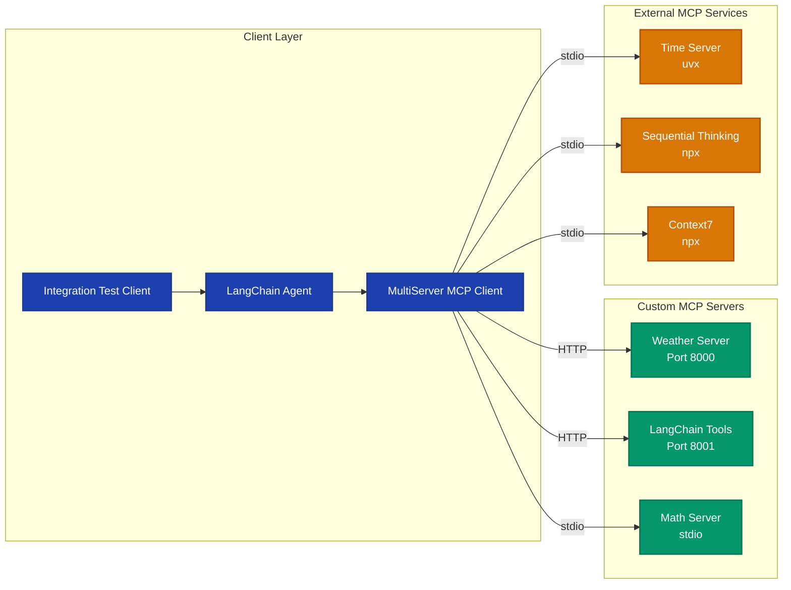
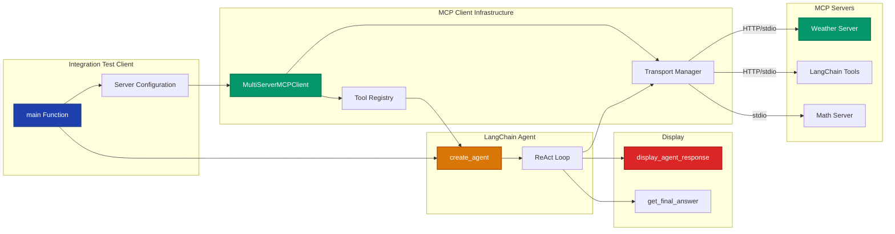
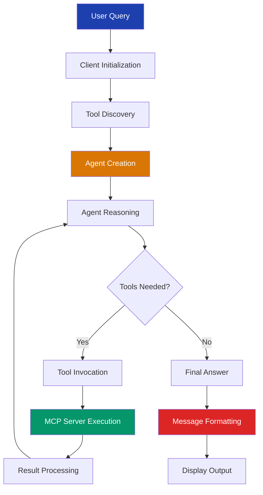

# Repository Architecture Documentation

## Overview

### Project Description

The **LangChain MCP Multi-Server Integration** project is an educational demonstration that showcases how to build sophisticated AI agent systems by integrating multiple Model Context Protocol (MCP) servers with LangChain agents. This project solves the challenge of orchestrating tools and capabilities from heterogeneous services (written in different languages, using different transports) into a unified agent framework.

**Key Problem Solved**: Traditional AI agent frameworks struggle with integrating tools from diverse sources. This project demonstrates a clean, protocol-based approach where tools can be exposed via MCP servers (Python, Node.js, or any language) and consumed uniformly by LangChain agents, regardless of the underlying transport (stdio, HTTP, SSE, WebSocket).

### Technology Stack

| Technology | Version | Purpose |
|------------|---------|---------|
| Python | >=3.13 | Primary language |
| MCP SDK | >=1.6.0 | Model Context Protocol implementation |
| LangChain | >=0.3.19 | Agent orchestration framework |
| LangChain MCP Adapters | >=0.1.11 | Bridge between MCP and LangChain |
| LangGraph | >=0.6.7 | Graph-based agent workflows |
| OpenAI | >=1.72.0 | LLM provider (GPT-4.1) |
| FastMCP | (via MCP SDK) | High-level server framework |
| Starlette | (transitive) | ASGI framework for HTTP servers |
| Uvicorn | (transitive) | ASGI server runtime |

**Core Architectural Components**:
- MCP Servers (stdio, streamable-http)
- MCP Clients (MultiServerMCPClient)
- LangChain Agents (ReAct pattern)
- Display Utilities (response formatting)

### Documentation Purpose

This documentation suite provides comprehensive architectural analysis for developers, architects, and learners who want to:

1. **Understand the System**: Grasp the high-level architecture and component relationships
2. **Build MCP Servers**: Learn patterns for exposing tools via MCP
3. **Integrate Multiple Servers**: Discover how to orchestrate tools from diverse sources
4. **Extend the Framework**: Add new transports, servers, or capabilities
5. **Optimize Performance**: Identify bottlenecks and optimization opportunities

The documentation was generated using AI-powered repository analysis agents that examined the codebase structure, traced data flows, and extracted key architectural patterns.

### Documentation Date

**Generated**: October 24, 2025
**Project Version**: 0.1.0
**Analysis Framework**: Repository Analysis Agents (ra_*)

---

## Quick Start

### For New Developers

**Recommended Learning Path**:

1. **Start Here**: Read this README to understand the big picture
2. **Understand the Architecture**: Review [Architecture Diagrams](diagrams/02_architecture_diagrams.md) to see system structure visually
3. **Explore Components**: Study [Component Inventory](docs/01_component_inventory.md) to understand what each module does
4. **Learn Data Flows**: Trace [Data Flow Analysis](docs/03_data_flows.md) to see how requests flow through the system
5. **Reference APIs**: Use [API Reference](docs/04_api_reference.md) to understand specific functions and usage

**Quick Run** (to see it in action):
```bash
# Terminal 1: Start Weather Server
python servers/weather_server.py

# Terminal 2: Start Math Tools Server
python servers/wrap_langchain_tools_server.py

# Terminal 3: Run Integration Test
python clients/integration_test.py
```

### For Architects

**Focus Areas**:

1. **System Architecture**: [Architecture Diagrams](diagrams/02_architecture_diagrams.md#system-architecture) - See the 4-layer architecture
2. **Design Patterns**: [Architecture Diagrams](diagrams/02_architecture_diagrams.md#design-patterns-observed) - Adapter, Strategy, Factory patterns
3. **Transport Comparison**: [Data Flows](docs/03_data_flows.md#transport-layers) - stdio vs HTTP vs SSE vs WebSocket
4. **Scalability**: [Architecture Diagrams](diagrams/02_architecture_diagrams.md#future-architecture-considerations) - Production deployment patterns
5. **Integration Points**: This README [Integration Points](#integration-points) section

### For API Consumers

**Focus Areas**:

1. **Server APIs**: [API Reference - Server APIs](docs/04_api_reference.md#server-apis) - Available tools and their schemas
2. **Client Patterns**: [API Reference - Client APIs](docs/04_api_reference.md#client-apis) - How to consume MCP tools
3. **Display Utilities**: [API Reference - Display Utilities](docs/04_api_reference.md#display-utilities) - Formatting agent responses
4. **Usage Examples**: [API Reference - Examples](docs/04_api_reference.md#examples) - Copy-paste ready code

---

## Architecture Summary

### System Overview

The system implements a **distributed microservices architecture** where:

- **MCP Servers** expose tools and capabilities through the Model Context Protocol
- **MCP Clients** discover and invoke tools from multiple servers concurrently
- **LangChain Agents** orchestrate multi-step reasoning using discovered tools
- **Display Utilities** format and present agent responses in various modes

The architecture is **transport-agnostic** (supports stdio, HTTP, SSE, WebSocket), **language-agnostic** (servers can be in any language), and **protocol-based** (uses JSON-RPC 2.0 for standardization).

### Architectural Layers

The system is organized into four distinct layers:

#### 1. **Client Layer** (Blue)
- **Integration Test Client** (`integration_test.py`): Entry point that configures servers and runs test scenarios
- **LangChain Agent**: ReAct-style agent that reasons about tools and executes plans
- **MultiServerMCPClient**: Manages connections to multiple servers, aggregates tools, routes requests
- **Display Utils**: Formats output with trace visualization, token tracking, answer extraction

**Key Pattern**: Transport-agnostic client treats all servers uniformly through the adapter pattern.

#### 2. **Custom MCP Server Layer** (Green)
- **Weather Server** (Port 8000): FastMCP HTTP server with async tools
- **LangChain Tools Server** (Port 8001): Converts LangChain tools to MCP format
- **Math Server** (stdio): Simple stdio transport for local tools
- **Example Server** (Port 3000): Low-level MCP implementation with stateless HTTP

**Key Pattern**: All servers expose the same protocol (MCP) but use different transports and implementation approaches.

#### 3. **External MCP Services Layer** (Orange)
- **Time Server**: Timezone-aware operations (via uvx)
- **Sequential Thinking**: Structured reasoning (via npx)
- **Context7**: Calendar integration with Cal.com API (via npx)
- **AI Docs Server**: Real-time documentation fetching (via uvx)

**Key Pattern**: External servers run as subprocesses, demonstrating MCP's language-agnostic nature.

#### 4. **External APIs & Services Layer** (Red)
- **OpenAI API**: LLM reasoning (GPT-4.1)
- **Cal.com API**: Calendar operations
- **llms.txt Docs**: Protocol documentation sources

**Key Pattern**: MCP servers abstract external APIs, providing unified tool interfaces to agents.

### Visual Overview



**Full System Architecture**: See [Architecture Diagrams - System Architecture](diagrams/02_architecture_diagrams.md#system-architecture)

### Key Architectural Decisions

#### 1. Multi-Transport Support

**Decision**: Support multiple transport protocols (stdio, streamable-http, SSE, WebSocket) through a unified client interface.

**Benefits**:
- **Flexibility**: Choose best transport for each use case (stdio for local, HTTP for network)
- **Interoperability**: Mix local subprocesses with remote HTTP services
- **Future-Proof**: Easy to add new transports without changing client code
- **Performance**: Use optimal transport per scenario (stdio fastest for local, HTTP best for web)

**Implementation**: `sessions.py` provides transport abstraction with factory pattern

**Reference**: [Data Flows - MCP Server Communication Flow](docs/03_data_flows.md#4-mcp-server-communication-flow)

#### 2. Language-Agnostic Server Design

**Decision**: Use MCP protocol (JSON-RPC 2.0) as the interface between clients and servers, allowing servers in any language.

**Benefits**:
- **Polyglot Architecture**: Python servers coexist with Node.js servers seamlessly
- **Ecosystem Leverage**: Use best tool for each server (Python for ML, Node.js for npm packages)
- **Team Flexibility**: Teams can use preferred languages
- **Third-Party Integration**: Easy to integrate external MCP servers

**Implementation**: Protocol-based communication via JSON-RPC, not language-specific imports

**Evidence**: Project uses Python servers AND Node.js servers (via npx) AND Rust servers (via uvx)

**Reference**: [Component Inventory - External Services](docs/01_component_inventory.md#3-mcp-server-layer---external-services-gray)

#### 3. Adapter Pattern for Tool Integration

**Decision**: Use bidirectional adapters to convert between LangChain and MCP formats.

**Benefits**:
- **Reuse Existing Tools**: Convert LangChain tools to MCP servers via `to_fastmcp()`
- **Consume MCP Tools**: Use MCP servers as LangChain tools via `MultiServerMCPClient`
- **Clean Separation**: Client and server code don't depend on each other
- **Standardization**: All tools expose same interface regardless of origin

**Implementation**: `langchain_mcp_adapters` library provides conversion functions

**Example**:
```python
# LangChain → MCP
from langchain_core.tools import tool
from langchain_mcp_adapters.tools import to_fastmcp

@tool
def add(a: int, b: int) -> int:
    return a + b

fastmcp_add = to_fastmcp(add)  # Now usable as MCP tool

# MCP → LangChain
client = MultiServerMCPClient({...})
tools = await client.get_tools()  # Returns LangChain BaseTool instances
```

**Reference**: [Architecture Diagrams - Design Patterns](diagrams/02_architecture_diagrams.md#design-patterns-observed)

#### 4. Modular Server Architecture

**Decision**: Provide both high-level (FastMCP) and low-level (Server) server frameworks with clear separation.

**Benefits**:
- **Ease of Use**: FastMCP provides decorator-based tool registration for simple cases
- **Control**: Low-level Server API for advanced use cases (stateless, custom handlers)
- **Progressive Complexity**: Start simple, graduate to advanced as needed
- **Educational Value**: Compare approaches to understand trade-offs

**Implementation**:
- **FastMCP**: `servers/weather_server.py`, `servers/math_server.py`
- **Low-Level Server**: `examples/servers/streamable-http-stateless/`

**Reference**: [API Reference - Server APIs](docs/04_api_reference.md#server-apis)

### Architectural Principles

Based on code analysis, the system follows these principles:

1. **Separation of Concerns**: Clients never import from servers; communication is protocol-only
2. **Transport Abstraction**: Application code is independent of transport choice
3. **Async-First Design**: All I/O operations use async/await for concurrency
4. **Type Safety**: Comprehensive type hints throughout codebase
5. **Observable Systems**: Rich message tracing and token usage tracking
6. **Fail-Fast Validation**: Early parameter validation with clear error messages
7. **Resource Management**: Proper cleanup via context managers
8. **Pagination Support**: Handles large result sets efficiently
9. **Protocol Versioning**: Negotiates capabilities and versions at connection time
10. **Extensibility**: Easy to add new servers, tools, and transports

---

## Component Overview

### Server Components

| Component | Purpose | Transport | Key Functions | Reference |
|-----------|---------|-----------|---------------|-----------|
| **Math Server** | Basic arithmetic operations | stdio | `add()`, `multiply()` | [servers/math_server.py:8-16](docs/01_component_inventory.md#1-add-a-int-b-int---int) |
| **Weather Server** | Mock weather service (demo) | streamable-http | `get_weather(location)` | [servers/weather_server.py:28-37](docs/01_component_inventory.md#3-get_weather-location-str---str) |
| **LangChain Tools Server** | Converts LangChain tools to MCP | streamable-http | `add()`, `multiply()` (converted) | [servers/wrap_langchain_tools_server.py:10-23](docs/01_component_inventory.md#langchain-tools-wrapper-server) |
| **Example Server** | Low-level MCP implementation | streamable-http | `add()`, `multiply()` (manual handlers) | [examples/.../server.py:59-135](docs/01_component_inventory.md#streamable-http-stateless-server-example) |

**Pattern**: All servers expose MCP protocol; transport and implementation vary

### Client Components

| Component | Purpose | Key Functions | Reference |
|-----------|---------|---------------|-----------|
| **Integration Test** | Comprehensive test suite | `main()` (4 test cases) | [clients/integration_test.py:66-274](docs/01_component_inventory.md#7-main-integration-test) |
| **MCP JSON Client** | Configuration-driven testing | `hardcoded_mcp_config()`, `show_mcp_tools_metadata()` | [clients/integration_test_mcp_json.py:40-87](docs/01_component_inventory.md#8-main-mcp-json-integration) |
| **Display Utils** | Response formatting | `display_agent_response()`, `get_final_answer()`, `print_tools_summary()` | [clients/display_utils.py:9-153](docs/01_component_inventory.md#client-utility-functions) |

**Pattern**: Clients use MultiServerMCPClient to connect to servers, LangChain agents for reasoning

### Utility Components

| Component | Purpose | Key Exports | Reference |
|-----------|---------|-------------|-----------|
| **display_utils.py** | Message formatting and display | `display_agent_response()`, `get_final_answer()`, `print_tools_summary()` | [docs/01_component_inventory.md#4-display_agent_response](docs/01_component_inventory.md#4-display_agent_responseresponse-show_full_tracetrue-show_token_usagefalse-return_final_answerfalse) |

### Configuration Components

| Component | Purpose | Reference |
|-----------|---------|-----------|
| **pyproject.toml** | Project metadata, dependencies | [docs/01_component_inventory.md#1-pyprojecttoml](docs/01_component_inventory.md#1-pyprojecttoml) |
| **.mcp.json** | External MCP server configurations | [docs/01_component_inventory.md#2-mcpjson](docs/01_component_inventory.md#2-mcpjson) |
| **.env.example** | Environment variable template | [docs/01_component_inventory.md#3-envexample](docs/01_component_inventory.md#3-envexample) |

### Component Relationships



**Full Component Relationships**: See [Architecture Diagrams - Component Relationships](diagrams/02_architecture_diagrams.md#component-relationships)

---

## Data Flows

This section summarizes the five main data flows in the system. For complete details with sequence diagrams, see [Data Flow Analysis](docs/03_data_flows.md).

### Flow Patterns Overview

| Flow | Purpose | Complexity | Reference |
|------|---------|------------|-----------|
| **Simple Query Flow** | Basic tool discovery and invocation | Low | [Data Flows #1](docs/03_data_flows.md#1-simple-query-flow) |
| **Interactive Session Flow** | Persistent connections for multiple operations | Medium | [Data Flows #2](docs/03_data_flows.md#2-interactive-client-session-flow) |
| **Tool Permission Flow** | User approval before tool execution | Medium | [Data Flows #3](docs/03_data_flows.md#3-tool-permission-callback-flow) |
| **MCP Server Communication** | Protocol-level handshake and operations | High | [Data Flows #4](docs/03_data_flows.md#4-mcp-server-communication-flow) |
| **Message Parsing** | Response formatting and display | Low | [Data Flows #5](docs/03_data_flows.md#5-message-parsing-and-routing-flow) |

### 1. Simple Query Flow

**Purpose**: Demonstrates basic client-server interaction with tool discovery and invocation.

**Key Steps**:
1. Client creates MultiServerMCPClient with server configurations
2. Client calls `get_tools()` to discover available tools from all servers
3. For each server: Create session → Initialize protocol → List tools → Convert to LangChain format
4. Agent created with aggregated tools
5. User submits query → Agent reasons about which tools to use
6. Agent invokes tools via MCP client → Server executes → Results returned
7. Agent synthesizes final answer from tool results

**Example**: Query "what is (15 + 27) * 3?" → Agent calls `add(15, 27)` → Result 42 → Agent calls `multiply(42, 3)` → Result 126

**Diagram**: See [Data Flow Analysis - Simple Query Flow](docs/03_data_flows.md#1-simple-query-flow)

### 2. Interactive Session Flow

**Purpose**: Maintains persistent connection to server for multiple operations, avoiding repeated handshakes.

**Key Steps**:
1. Client requests session via context manager: `async with client.session("server_name")`
2. Session validates server name exists
3. Transport-specific session created (stdio spawns subprocess, HTTP opens connection)
4. Protocol initialization if `auto_initialize=True` (default)
5. Session yielded to client for multiple operations
6. Client performs operations (list_tools, call_tool, read_resource) using same session
7. Context exit triggers cleanup (connection closed, process terminated)

**Benefits**:
- Lower latency after initialization (no repeated handshakes)
- Resource efficiency (single connection/process)
- State preservation across operations

**Diagram**: See [Data Flow Analysis - Interactive Session Flow](docs/03_data_flows.md#2-interactive-client-session-flow)

### 3. Tool Permission Callback Flow

**Purpose**: Allows applications to request user consent before executing tools (security/compliance).

**Key Steps**:
1. Client defines approval callback function
2. Callback passed to session via `session_kwargs`
3. When agent requests tool execution, MCP session checks if approval required
4. If required, callback invoked with tool name and arguments
5. User approves or denies
6. If approved: Tool executes normally
7. If denied: ToolException raised, agent handles gracefully

**Use Cases**: Security-sensitive operations, compliance requirements, cost control

**Implementation**: Not explicitly shown in current code but supported via MCP SDK

**Diagram**: See [Data Flow Analysis - Tool Permission Callback Flow](docs/03_data_flows.md#3-tool-permission-callback-flow)

### 4. MCP Server Communication Flow

**Purpose**: Shows complete protocol lifecycle from connection through tool execution.

**Key Steps**:
1. **Connection Establishment**: Transport-specific connection created (stdio, HTTP, SSE, WebSocket)
2. **Protocol Initialization**: Client sends `initialize` request with capabilities
3. **Capability Negotiation**: Server responds with supported features (tools, resources, prompts)
4. **Tool Discovery**: Client calls `list_tools()`, handles pagination with cursors
5. **Tool Schema Validation**: Schemas parsed, Pydantic models created, LangChain wrappers generated
6. **Tool Invocation**: Arguments validated, JSON-RPC request sent, tool executed, result converted
7. **Error Handling**: Tool errors, protocol errors, transport errors handled at appropriate layers
8. **Resource/Prompt Operations**: Optional operations if server supports them
9. **Session Termination**: Cleanup (for HTTP: optional termination request)

**Protocol**: JSON-RPC 2.0 over various transports

**Diagram**: See [Data Flow Analysis - MCP Server Communication Flow](docs/03_data_flows.md#4-mcp-server-communication-flow)

### 5. Message Parsing and Routing Flow

**Purpose**: Transforms agent responses into formatted output for different use cases.

**Key Steps**:
1. Agent completes execution, returns response dictionary with message list
2. `display_agent_response()` called with display options
3. Messages extracted and iterated
4. Each message type handled differently:
   - **AIMessage**: Check for tool calls or final answer, optionally show token usage
   - **ToolMessage**: Show result with success (✓) or error (❌) indicator
   - **HumanMessage**: Display user query
5. Output mode determines display:
   - **Full Trace**: Show all messages with formatting
   - **Minimal**: Show only final answer
   - **Programmatic**: Return answer text without display

**Display Modes**:
- Development/Debugging: Full trace + token usage
- Production UI: Minimal display (final answer only)
- Automated Pipelines: Programmatic extraction (`get_final_answer()`)

**Diagram**: See [Data Flow Analysis - Message Parsing and Routing Flow](docs/03_data_flows.md#5-message-parsing-and-routing-flow)

### Flow Pattern Summary



---

## API Reference Summary

This section provides high-level summaries. For complete API documentation with examples, see [API Reference](docs/04_api_reference.md).

### Server APIs

#### Math Server API
- **Functions**: `add(a: int, b: int) -> int`, `multiply(a: int, b: int) -> int`
- **Transport**: stdio
- **Usage**: Process-based invocation via subprocess
- **Example**:
  ```python
  # In client
  client = MultiServerMCPClient({
      "math": {"command": "python", "args": ["math_server.py"], "transport": "stdio"}
  })
  tools = await client.get_tools()
  # Tools include 'add' and 'multiply'
  ```
- **Details**: See [API Reference - Math Server](docs/04_api_reference.md#math-server)

#### Weather Server API
- **Functions**: `get_weather(location: str) -> str`
- **Transport**: streamable-http
- **Usage**: HTTP POST to `http://localhost:8000/mcp`
- **Example**:
  ```python
  client = MultiServerMCPClient({
      "weather": {"url": "http://localhost:8000/mcp", "transport": "streamable_http"}
  })
  ```
- **Details**: See [API Reference - Weather Server](docs/04_api_reference.md#weather-server)

#### LangChain Tools Wrapper Server API
- **Functions**: Dynamically generated from LangChain tools (add, multiply in demo)
- **Transport**: streamable-http
- **Key Feature**: Converts LangChain `@tool` decorated functions to MCP tools
- **Example**:
  ```python
  from langchain_mcp_adapters.tools import to_fastmcp
  @tool
  def custom_tool(param: str) -> str:
      return f"Result: {param}"

  fastmcp_tool = to_fastmcp(custom_tool)
  # Now usable in FastMCP server
  ```
- **Details**: See [API Reference - LangChain Tools Wrapper Server](docs/04_api_reference.md#langchain-tools-wrapper-server)

### Client APIs

#### Integration Test Client
- **Purpose**: Comprehensive test suite validating multi-server integration
- **Key Function**: `main()` - Runs 4 test cases demonstrating different patterns
- **Test Cases**:
  1. Multi-step reasoning with full trace display
  2. Cross-server tool invocation with minimal display
  3. Programmatic answer extraction
  4. Complex multi-step sequential reasoning
- **Usage**:
  ```bash
  python clients/integration_test.py
  ```
- **Details**: See [API Reference - Integration Test Client](docs/04_api_reference.md#integration-test-client)

#### MCP JSON Client
- **Purpose**: Demonstrates stdio transport with hard-coded configuration
- **Key Functions**:
  - `hardcoded_mcp_config()` - Returns MCP server definitions
  - `show_mcp_tools_metadata()` - Displays tool metadata
- **Usage**: Shows how to integrate subprocess-based servers (uvx, npx)
- **Details**: See [API Reference - MCP JSON Client](docs/04_api_reference.md#mcp-json-client)

### Display Utilities

| Function | Purpose | Usage |
|----------|---------|-------|
| `display_agent_response()` | Formats and displays agent responses | Development debugging, UI display |
| `get_final_answer()` | Extracts answer text without display | Automated pipelines, conditional logic |
| `print_tools_summary()` | Shows available tools | Tool discovery, documentation |

**Example**:
```python
# Full trace for debugging
display_agent_response(response, show_full_trace=True, show_token_usage=True)

# Minimal display for production
display_agent_response(response, show_full_trace=False)

# Programmatic extraction
answer = get_final_answer(response)
if "126" in answer:
    proceed_with_next_step()
```

**Details**: See [API Reference - Display Utilities](docs/04_api_reference.md#display-utilities)

---

## Key Insights

### Strengths

1. **Clean Separation of Concerns**
   - Clients and servers have no code dependencies, only protocol dependencies
   - Transport layer abstracted from application logic
   - Display utilities independent of agent logic
   - **Evidence**: Client modules never import from server modules

2. **Extensible Design**
   - Easy to add new servers without modifying clients
   - New transports added by implementing session factory
   - Tools can be added to servers via decorators
   - **Example**: Adding a new HTTP server requires only configuration change in client

3. **Protocol Flexibility**
   - Supports multiple transports transparently (stdio, HTTP, SSE, WebSocket)
   - JSON-RPC 2.0 provides standard communication format
   - Version negotiation ensures compatibility
   - **Benefit**: Mix local and remote servers, Python and Node.js servers seamlessly

4. **Observable System**
   - Rich message tracing shows complete agent reasoning
   - Token usage tracking for cost analysis
   - Tool invocation logging for debugging
   - Error states clearly indicated with emojis (✓, ❌)
   - **Implementation**: `display_utils.py` provides comprehensive observability

5. **Educational Value**
   - Multiple server patterns (FastMCP, low-level)
   - Progressive complexity (simple to advanced)
   - Well-commented code with docstrings
   - Comprehensive test cases
   - **Audience**: Ideal for learning MCP, LangChain, agent patterns

### Patterns and Practices

#### 1. Server Pattern
**Description**: Use FastMCP for rapid development, low-level Server for fine control

**Implementation**:
```python
# FastMCP Pattern (servers/weather_server.py)
from mcp.server.fastmcp import FastMCP
mcp = FastMCP("Weather")

@mcp.tool()
async def get_weather(location: str) -> str:
    return f"It's sunny in {location}"

mcp.run(transport="streamable-http")

# Low-Level Pattern (examples/servers/streamable-http-stateless/)
from mcp.server.lowlevel import Server
app = Server("my-server")

@app.call_tool()
async def call_tool(name: str, arguments: dict):
    # Manual routing and handling
    pass

@app.list_tools()
async def list_tools():
    # Manual schema definition
    pass
```

**Use FastMCP When**: Quick prototyping, simple tools, learning MCP
**Use Low-Level When**: Custom middleware, stateless operation, advanced control

#### 2. Client Pattern
**Description**: Use MultiServerMCPClient to aggregate tools from multiple servers

**Implementation**:
```python
from langchain_mcp_adapters.client import MultiServerMCPClient
from langchain.agents import create_agent

# Configure multiple servers
client = MultiServerMCPClient({
    "server1": {"url": "http://localhost:8000/mcp", "transport": "streamable_http"},
    "server2": {"command": "python", "args": ["server2.py"], "transport": "stdio"},
})

# Discover all tools
tools = await client.get_tools()

# Create agent with aggregated tools
agent = create_agent("openai:gpt-4.1", tools)

# Execute queries
response = await agent.ainvoke({"messages": "your query"})
```

**Benefits**: Unified tool interface, concurrent tool loading, transport abstraction

#### 3. Adapter Pattern
**Description**: Convert between LangChain and MCP formats bidirectionally

**LangChain → MCP** (for server development):
```python
from langchain_core.tools import tool
from langchain_mcp_adapters.tools import to_fastmcp

@tool
def my_function(param: str) -> str:
    """My LangChain tool"""
    return f"Result: {param}"

# Convert to FastMCP tool
fastmcp_tool = to_fastmcp(my_function)
```

**MCP → LangChain** (for client consumption):
```python
# MultiServerMCPClient automatically converts MCP tools to LangChain BaseTool
client = MultiServerMCPClient({...})
tools = await client.get_tools()  # Returns List[BaseTool]
```

**Benefits**: Reuse existing tools, interoperability, clean interfaces

#### 4. Display Pattern
**Description**: Flexible response formatting with multiple display modes

**Implementation**:
```python
from clients.display_utils import display_agent_response, get_final_answer

# Mode 1: Full trace (debugging)
display_agent_response(response, show_full_trace=True, show_token_usage=True)

# Mode 2: Minimal (production UI)
display_agent_response(response, show_full_trace=False)

# Mode 3: Programmatic (automated pipelines)
answer = get_final_answer(response)
process_answer(answer)
```

**Use Cases**:
- **Full Trace**: Development, debugging, understanding agent reasoning
- **Minimal**: Production UIs, clean output
- **Programmatic**: Automated testing, conditional logic, data pipelines

### Integration Points

#### 1. MCP Protocol Integration
**What**: JSON-RPC 2.0 protocol for client-server communication

**Key Operations**:
- `initialize` - Protocol handshake and capability negotiation
- `tools/list` - Discover available tools with pagination
- `tools/call` - Execute tool with arguments
- `resources/list`, `resources/read` - Resource operations (optional)
- `prompts/get` - Prompt template retrieval (optional)

**Transports**: stdio, streamable-http, SSE, WebSocket

**Reference**: [Data Flows - MCP Server Communication Flow](docs/03_data_flows.md#4-mcp-server-communication-flow)

#### 2. LangChain Integration
**What**: Integration with LangChain agent framework

**Key Components**:
- `MultiServerMCPClient` - MCP client that returns LangChain-compatible tools
- `create_agent()` - Creates ReAct agent with tools
- `agent.ainvoke()` - Executes agent with query
- Message types (AIMessage, ToolMessage, HumanMessage) - Agent communication format

**Data Flow**: MCP tools → MultiServerMCPClient → BaseTool instances → LangChain Agent

**Reference**: [Component Inventory - Integration Patterns](docs/01_component_inventory.md#integration-patterns)

#### 3. OpenAI API Integration
**What**: LLM backend for agent reasoning

**Usage**: Agent uses OpenAI API (GPT-4.1) for:
- Analyzing available tools
- Deciding which tools to call
- Extracting arguments from user queries
- Synthesizing final answers from tool results

**Configuration**: Via `OPENAI_API_KEY` environment variable

**Model**: `openai:gpt-4.1` (specified in `create_agent()` call)

#### 4. External APIs Integration
**What**: Third-party services accessed through MCP servers

**Examples**:
- **Cal.com API**: Calendar operations via Context7 MCP server
- **llms.txt Docs**: Documentation fetching via AI Docs Server
- **Custom APIs**: Any API can be wrapped in MCP server

**Pattern**: External API → MCP Server (wrapper) → MCP Client → Agent

**Benefit**: Unified tool interface regardless of underlying API complexity

---

## Project Statistics

### Code Metrics

- **Total Python Files**: 11 (excluding analysis framework)
- **Server Implementations**: 4 (Math, Weather, LangChain Wrapper, Example Low-Level)
- **Client Implementations**: 3 (Integration Test, MCP JSON Test, Display Utils)
- **Lines of Code**: ~922 lines (core project, excluding examples and generated files)
- **Public Functions**: 12 (across all modules)
- **MCP Servers Configured**: 8 (4 custom + 4 external in .mcp.json)

**Breakdown**:
- Servers: ~150 lines (3 files)
- Clients: ~430 lines (3 files)
- Display Utils: ~154 lines (1 file)
- Example Server: ~188 lines (1 file)

**Observation**: Compact codebase demonstrates MCP's ease of use. Minimal boilerplate, maximum functionality.

### Documentation Metrics

- **Architecture Documents**: 4 (Component Inventory, Architecture Diagrams, Data Flows, API Reference)
- **Diagrams Generated**: 5 (System Architecture, Component Relationships, Class Hierarchies, Module Dependencies, Data Flow)
- **Flows Documented**: 5 (Simple Query, Interactive Session, Tool Permission, MCP Communication, Message Parsing)
- **APIs Documented**: 15+ functions with complete examples
- **Code Examples**: 30+ copy-paste ready examples

---

## Technology Dependencies

### Core Dependencies

| Dependency | Version | Purpose |
|------------|---------|---------|
| `langchain` | >=0.3.19 | Agent orchestration framework |
| `langchain-mcp-adapters` | >=0.1.11 | Bridge between MCP and LangChain |
| `langchain-openai` | >=0.3.7 | OpenAI LLM integration |
| `langgraph` | >=0.6.7 | Graph-based agent workflows |
| `mcp[cli]` | >=1.6.0 | Model Context Protocol SDK |
| `openai` | >=1.72.0 | OpenAI API client |
| `python-dotenv` | >=1.1.0 | Environment variable management |
| `claude-agent-sdk` | >=0.1.4 | Claude Agent SDK (for analysis) |
| `numpy` | >=2.2.4 | Numerical computing |
| `tavily-python` | >=0.5.4 | Tavily search integration |
| `ipykernel` | >=7.0.1 | Jupyter notebook support |

### Transport Libraries

**Included in MCP SDK**:
- `httpx` - HTTP client with connection pooling (for streamable-http, SSE)
- `starlette` - ASGI framework (for HTTP servers)
- `uvicorn` - ASGI server runtime
- `websockets` - WebSocket support (optional, install via `mcp[ws]`)

### Development Tools

**Command-Line**:
- `argparse` - CLI argument parsing (stdlib)
- `click` - Advanced CLI framework (used in example server)

**Environment**:
- `python-dotenv` - .env file loading

**Async**:
- `asyncio` - Async/await framework (stdlib)
- `contextlib` - Context managers (stdlib)

**Logging**:
- `logging` - Standard logging (stdlib)

---

## Getting Started

### Prerequisites

- **Python**: >=3.13
- **API Keys**:
  - `OPENAI_API_KEY` (required for agent reasoning)
  - `CALCOM_API_KEY` (optional, for Context7 server)
  - `LANGSMITH_API_KEY` (optional, for LangSmith tracing)
- **Node.js**: For external npx-based servers (optional)
- **uv**: For uvx-based servers (optional)

### Installation

```bash
# Clone repository
git clone <repository-url>
cd langchain-mcp-multiserver-demo

# Install dependencies with uv (recommended)
uv pip install -e .

# Or with pip
pip install -e .

# Set up environment variables
cp .env.example .env
# Edit .env and add your API keys
```

### Running Servers

```bash
# Math Server (stdio)
python servers/math_server.py

# Weather Server (HTTP, default port 8000)
python servers/weather_server.py

# Weather Server (custom port)
python servers/weather_server.py --port 8080 --host 0.0.0.0

# LangChain Tools Server (HTTP, default port 8001)
python servers/wrap_langchain_tools_server.py

# Example Low-Level Server (HTTP, default port 3000)
cd examples/servers/streamable-http-stateless
uv run mcp-simple-streamablehttp-stateless
```

### Running Clients

```bash
# Integration Test (requires servers running)
# Terminal 1: python servers/weather_server.py
# Terminal 2: python servers/wrap_langchain_tools_server.py
# Terminal 3:
python clients/integration_test.py

# MCP JSON Test (spawns servers as subprocesses)
python clients/integration_test_mcp_json.py
```

### Configuration

**Environment Variables** (.env file):
```bash
OPENAI_API_KEY=sk-...
LANGSMITH_TRACING=true
LANGSMITH_PROJECT=your-project
LANGSMITH_API_KEY=lsv2_...
CALCOM_API_KEY=cal_...
```

**Server Configuration** (in client code):
```python
client = MultiServerMCPClient({
    "server_name": {
        # HTTP server
        "url": "http://localhost:8000/mcp",
        "transport": "streamable_http",

        # OR stdio server
        # "command": "python",
        # "args": ["path/to/server.py"],
        # "transport": "stdio",
    }
})
```

**See Also**: [API Reference - Configuration](docs/04_api_reference.md#configuration)

---

## Documentation Structure

### Available Documents

| Document | Description | What You'll Learn |
|----------|-------------|-------------------|
| [Component Inventory](docs/01_component_inventory.md) | Complete inventory of all modules, classes, and functions | What components exist and their purposes |
| [Architecture Diagrams](diagrams/02_architecture_diagrams.md) | Visual architecture diagrams with Mermaid | System structure and relationships |
| [Data Flow Analysis](docs/03_data_flows.md) | Detailed sequence diagrams of data flows | How data moves through the system |
| [API Reference](docs/04_api_reference.md) | Comprehensive API documentation with examples | How to use the APIs |

### Documentation Navigation

#### For Understanding Architecture

1. Read this README for overview
2. Review [Architecture Diagrams](diagrams/02_architecture_diagrams.md) for visual understanding
3. Study [Component Inventory](docs/01_component_inventory.md) for detailed components

**Recommended Flow**: README → Architecture Diagrams → Component Inventory

#### For Understanding Flows

1. Review [Data Flow Analysis](docs/03_data_flows.md)
2. Cross-reference with [Architecture Diagrams](diagrams/02_architecture_diagrams.md)

**Recommended Flow**: Data Flows (pick your scenario) → Architecture Diagrams (see components involved)

#### For Implementation

1. Start with [API Reference](docs/04_api_reference.md)
2. Study code examples
3. Reference [Component Inventory](docs/01_component_inventory.md) for implementation details

**Recommended Flow**: API Reference (find function) → See example → Component Inventory (understand internals)

---

## Use Cases

### Use Case 1: Building a New MCP Server

**Scenario**: You want to expose a custom tool as an MCP server.

**Steps**:
1. Choose server framework (FastMCP for simplicity, low-level for control)
2. Review [API Reference - Server APIs](docs/04_api_reference.md#server-apis) for patterns
3. Study [Component Inventory - Server Components](docs/01_component_inventory.md#server-components) for examples
4. Implement tool functions with `@mcp.tool()` decorator (FastMCP) or handlers (low-level)
5. Test with integration client

**Relevant Documentation**:
- [API Reference - Math Server](docs/04_api_reference.md#math-server) - Simple stdio example
- [API Reference - Weather Server](docs/04_api_reference.md#weather-server) - HTTP example
- [API Reference - LangChain Tools Wrapper](docs/04_api_reference.md#langchain-tools-wrapper-server) - Conversion pattern

**Quick Start Code**:
```python
from mcp.server.fastmcp import FastMCP

mcp = FastMCP("MyServer")

@mcp.tool()
def my_tool(param: str) -> str:
    """My custom tool"""
    return f"Processed: {param}"

if __name__ == "__main__":
    mcp.run(transport="streamable-http")  # or "stdio"
```

### Use Case 2: Integrating Multiple Servers

**Scenario**: You want to create an agent that uses tools from multiple servers.

**Steps**:
1. Start your MCP servers (or use existing ones)
2. Review [Data Flows - Simple Query Flow](docs/03_data_flows.md#1-simple-query-flow) for pattern
3. Study [API Reference - Integration Test Client](docs/04_api_reference.md#integration-test-client) for complete example
4. Configure MultiServerMCPClient with server details
5. Get tools and create agent
6. Test with queries

**Relevant Documentation**:
- [Data Flows - Simple Query Flow](docs/03_data_flows.md#1-simple-query-flow) - Basic pattern
- [Architecture Diagrams - Component Relationships](diagrams/02_architecture_diagrams.md#component-relationships) - How components interact
- [API Reference - Client APIs](docs/04_api_reference.md#client-apis) - Client patterns

**Quick Start Code**:
```python
from langchain_mcp_adapters.client import MultiServerMCPClient
from langchain.agents import create_agent

# Configure servers
client = MultiServerMCPClient({
    "weather": {"url": "http://localhost:8000/mcp", "transport": "streamable_http"},
    "math": {"command": "python", "args": ["math_server.py"], "transport": "stdio"},
})

# Get tools and create agent
tools = await client.get_tools()
agent = create_agent("openai:gpt-4.1", tools)

# Execute query
response = await agent.ainvoke({"messages": "What's the weather in NYC and what's 5 + 3?"})
```

### Use Case 3: Customizing Message Display

**Scenario**: You want to format agent responses differently for various contexts (debugging, production, automation).

**Steps**:
1. Review [Data Flows - Message Parsing and Routing Flow](docs/03_data_flows.md#5-message-parsing-and-routing-flow)
2. Study [API Reference - Display Utilities](docs/04_api_reference.md#display-utilities)
3. Choose display mode based on use case
4. Optionally extend display_utils for custom formatting

**Relevant Documentation**:
- [API Reference - Display Utilities](docs/04_api_reference.md#display-utilities) - All display functions
- [Data Flows - Message Parsing](docs/03_data_flows.md#5-message-parsing-and-routing-flow) - How messages are processed
- [Component Inventory - Display Utils](docs/01_component_inventory.md#clients-display_utilspy) - Implementation details

**Quick Start Code**:
```python
from clients.display_utils import display_agent_response, get_final_answer

# Debugging: Full trace with token usage
display_agent_response(response, show_full_trace=True, show_token_usage=True)

# Production: Minimal display
display_agent_response(response, show_full_trace=False)

# Automation: Programmatic extraction
answer = get_final_answer(response)
if "126" in answer:
    proceed()
```

---

## Troubleshooting

### Common Issues

#### 1. Server Connection Issues

**Symptoms**:
- "Failed to connect" errors
- "Connection refused" messages
- Timeout errors

**Solutions**:
```bash
# Check if server is running
curl http://localhost:8000/mcp  # For HTTP servers
ps aux | grep python  # For all servers

# Verify port is correct
python servers/weather_server.py --port 8000  # Explicit port

# Check firewall/network
telnet localhost 8000  # Test connectivity

# For stdio servers, verify command
which python  # Ensure Python in PATH
python servers/math_server.py  # Test manually
```

**See Also**: [Data Flows - Error Handling](docs/03_data_flows.md#error-handling)

#### 2. Tool Execution Failures

**Symptoms**:
- ToolException raised
- "Tool not found" errors
- Invalid argument errors

**Solutions**:
```python
# Check tool discovery
tools = await client.get_tools()
print_tools_summary(tools)  # Verify tools loaded

# Validate server responding
async with client.session("server_name") as session:
    result = await session.list_tools()
    print(result)  # Check what server returns

# Test tool manually
async with client.session("server_name") as session:
    result = await session.call_tool("tool_name", {"arg": "value"})
    print(result)
```

**See Also**: [Data Flows - Tool Invocation](docs/03_data_flows.md#tool-invocation-phase)

#### 3. Configuration Errors

**Symptoms**:
- "Missing 'transport' key" errors
- "Server not found" errors
- Environment variable not loaded

**Solutions**:
```python
# Verify .env file loaded
from dotenv import load_dotenv
load_dotenv()
import os
print(os.environ.get("OPENAI_API_KEY"))  # Check if loaded

# Validate server configuration
config = {
    "server": {
        "transport": "streamable_http",  # REQUIRED
        "url": "http://localhost:8000/mcp",  # REQUIRED for HTTP
        # OR for stdio:
        # "command": "python",
        # "args": ["server.py"],
    }
}
client = MultiServerMCPClient(config)

# Check server name matches
print(list(client.connections.keys()))  # Available server names
```

**See Also**: [API Reference - Configuration](docs/04_api_reference.md#configuration)

---

## Glossary

### Key Terms

- **MCP (Model Context Protocol)**: A standardized protocol for exposing tools, resources, and prompts to AI applications. Uses JSON-RPC 2.0 for communication.

- **LangChain**: An open-source framework for building applications with large language models. Provides agent orchestration, tool integration, and workflow management.

- **FastMCP**: A high-level framework for building MCP servers using decorators. Part of the MCP SDK, it simplifies server development.

- **Transport**: The communication mechanism between MCP clients and servers. Supported transports: stdio (subprocess), streamable-http (HTTP + SSE), SSE (Server-Sent Events), WebSocket.

- **Tool**: A function or capability exposed by an MCP server that can be invoked by agents. Tools have names, descriptions, and JSON Schema parameter definitions.

- **Agent**: An AI system that reasons about tasks and decides which tools to use. Uses LLM (e.g., GPT-4.1) for decision-making and orchestrates tool calls.

- **Session**: A persistent connection between a client and server that maintains state across multiple operations. Created via `client.session()` context manager.

- **BaseTool**: LangChain's abstract tool interface. MCP tools are converted to BaseTool instances for agent consumption.

- **JSON-RPC 2.0**: The underlying protocol format used by MCP for request/response communication.

- **Stdio (Standard Input/Output)**: A transport that uses subprocess stdin/stdout for communication. Ideal for local tools.

- **Streamable HTTP**: A transport that uses HTTP POST for requests and Server-Sent Events (SSE) for server-to-client messages.

- **ReAct Pattern**: Reasoning + Acting pattern where agent alternates between reasoning about the task and acting (calling tools).

- **MultiServerMCPClient**: The client class that manages connections to multiple MCP servers and aggregates tools.

- **Tool Call**: An AIMessage that contains requests to execute one or more tools with specific arguments.

- **Tool Result**: A ToolMessage that contains the output from tool execution (success or error).

---

## Additional Resources

### External Documentation
- [MCP SDK Documentation](https://modelcontextprotocol.io/)
- [LangChain Documentation](https://python.langchain.com/)
- [LangGraph Documentation](https://langchain-ai.github.io/langgraph/)
- [FastMCP Documentation](https://github.com/jlowin/fastmcp)
- [OpenAI API Documentation](https://platform.openai.com/docs)

### Project Resources
- **Main Project README**: `/home/donbr/don-aie-cohort8/aie8-s13-langchain-mcp/README.md`
- **Configuration Examples**: `.mcp.json`, `.env.example`
- **Example Notebooks**: `clients/langchain_mcp_adapter_client.ipynb`
- **Transport Comparison**: `docs/TRANSPORT_COMPARISON.md`
- **Migration Guide**: `docs/LANGGRAPH_MIGRATION_V1.md`

---

## Metadata

**Documentation Version**: 1.0
**Generated Date**: October 24, 2025
**Project Version**: 0.1.0 (from pyproject.toml)
**Last Updated**: October 24, 2025
**Analysis Framework**: Repository Analysis Agents
**Python Version**: >=3.13

---

## Quick Reference Card

### Common Commands

```bash
# Start servers
python servers/weather_server.py
python servers/wrap_langchain_tools_server.py

# Run integration tests
python clients/integration_test.py

# Run MCP JSON test
python clients/integration_test_mcp_json.py

# Run example low-level server
cd examples/servers/streamable-http-stateless
uv run mcp-simple-streamablehttp-stateless
```

### Key File Locations

**Servers**:
- `/home/donbr/don-aie-cohort8/aie8-s13-langchain-mcp/servers/math_server.py`
- `/home/donbr/don-aie-cohort8/aie8-s13-langchain-mcp/servers/weather_server.py`
- `/home/donbr/don-aie-cohort8/aie8-s13-langchain-mcp/servers/wrap_langchain_tools_server.py`

**Clients**:
- `/home/donbr/don-aie-cohort8/aie8-s13-langchain-mcp/clients/integration_test.py`
- `/home/donbr/don-aie-cohort8/aie8-s13-langchain-mcp/clients/integration_test_mcp_json.py`
- `/home/donbr/don-aie-cohort8/aie8-s13-langchain-mcp/clients/display_utils.py`

**Configuration**:
- `/home/donbr/don-aie-cohort8/aie8-s13-langchain-mcp/.mcp.json`
- `/home/donbr/don-aie-cohort8/aie8-s13-langchain-mcp/pyproject.toml`
- `/home/donbr/don-aie-cohort8/aie8-s13-langchain-mcp/.env.example`

**Examples**:
- `/home/donbr/don-aie-cohort8/aie8-s13-langchain-mcp/examples/servers/streamable-http-stateless/`

### Essential Reading Order

1. **This README** (you are here!) - Big picture overview
2. [Architecture Diagrams](diagrams/02_architecture_diagrams.md) - Visual understanding of system structure
3. [API Reference](docs/04_api_reference.md) - Start coding with examples
4. [Data Flows](docs/03_data_flows.md) - Deep dive into how things work
5. [Component Inventory](docs/01_component_inventory.md) - Complete reference of all components

### Quick Code Snippets

**Create MCP Server**:
```python
from mcp.server.fastmcp import FastMCP
mcp = FastMCP("MyServer")

@mcp.tool()
def my_tool(param: str) -> str:
    return f"Result: {param}"

mcp.run(transport="streamable-http")
```

**Connect to MCP Servers**:
```python
from langchain_mcp_adapters.client import MultiServerMCPClient
client = MultiServerMCPClient({
    "server1": {"url": "http://localhost:8000/mcp", "transport": "streamable_http"}
})
tools = await client.get_tools()
```

**Create Agent**:
```python
from langchain.agents import create_agent
agent = create_agent("openai:gpt-4.1", tools)
response = await agent.ainvoke({"messages": "your query"})
```

**Display Response**:
```python
from clients.display_utils import display_agent_response
display_agent_response(response, show_full_trace=True, show_token_usage=True)
```

---

## Contributing

### Architecture Review Process

When making changes to the system architecture:

1. **Review Relevant Documentation**: Read architecture documents related to your changes
2. **Understand Affected Data Flows**: Check data flow diagrams for impacted paths
3. **Update Documentation**: If architecture changes, update relevant docs
4. **Ensure Alignment**: Changes should align with architectural principles listed above
5. **Add Tests**: Update integration tests to cover new functionality

### Documentation Updates

**When to Update Documentation**:
- Adding new servers or transports
- Changing data flow patterns
- Adding new client patterns
- Modifying APIs
- Adding new architectural layers

**How to Update**:
1. Regenerate affected sections using analysis agents
2. Update code examples to match changes
3. Update diagrams if visual structure changed
4. Verify all file paths and line numbers are current
5. Update this README with high-level changes

---

**End of README** - For detailed documentation, see the linked documents above.
