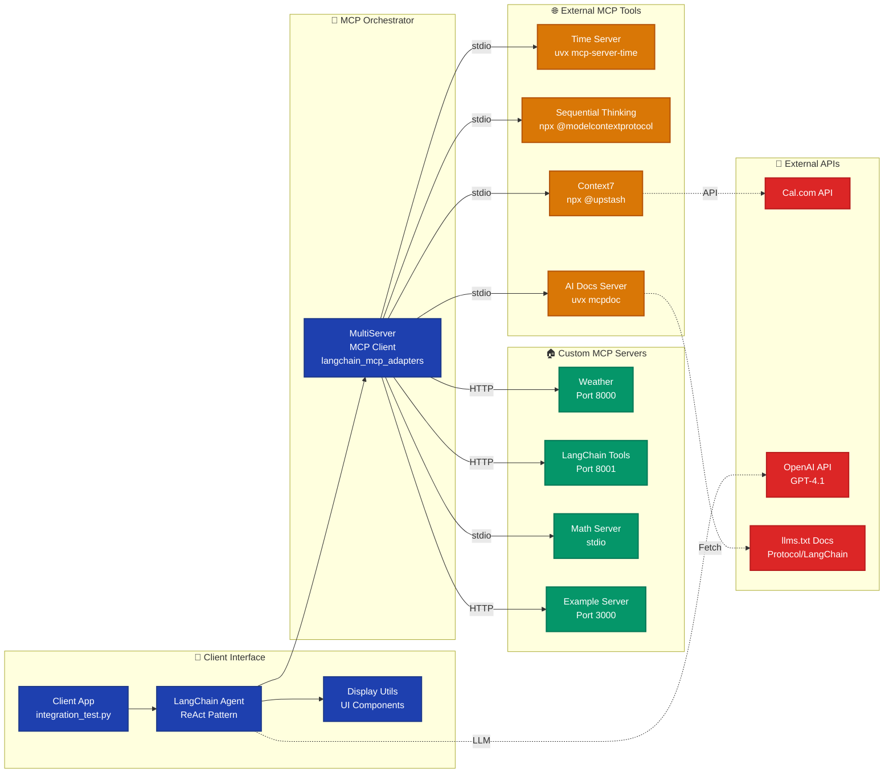
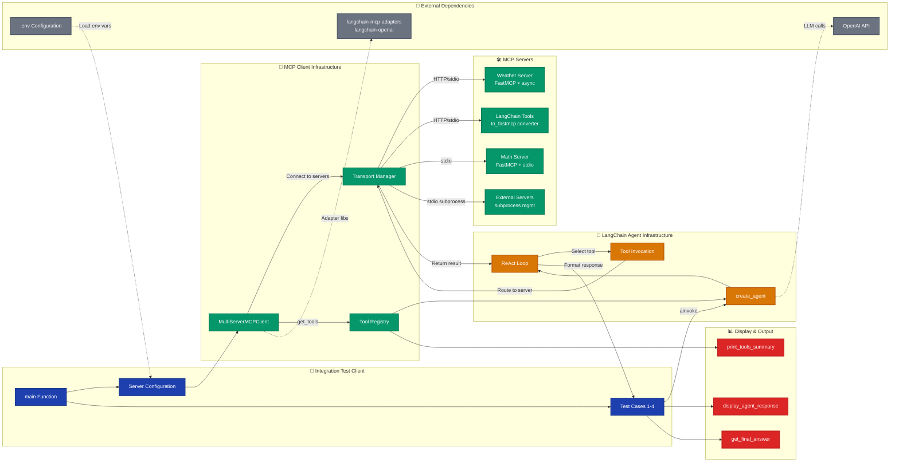
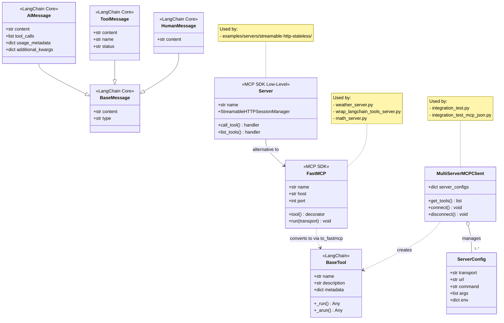
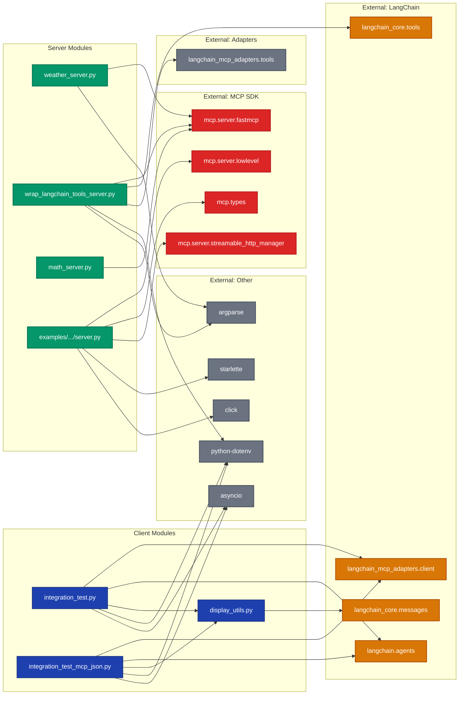
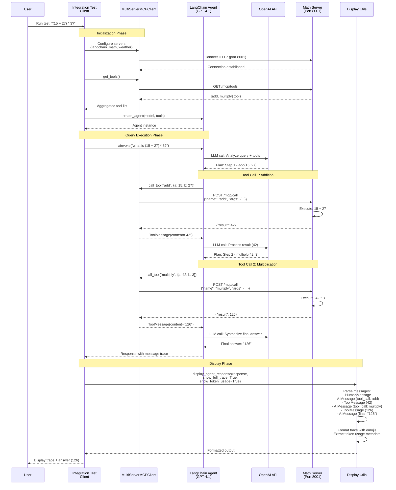

# Architecture Diagrams

## Overview

This document provides comprehensive architecture diagrams for the LangChain MCP Multi-Server Integration project. The project demonstrates a modern, modular approach to integrating multiple Model Context Protocol (MCP) servers with LangChain agents, enabling sophisticated multi-tool orchestration across heterogeneous services.

The system follows a client-server architecture where:
- **MCP Servers** expose tools and capabilities through the Model Context Protocol
- **MCP Clients** discover and invoke tools from multiple servers
- **LangChain Agents** orchestrate tool calls to solve complex tasks
- **Display Utilities** format and present agent responses

The architecture supports multiple transport protocols (stdio, streamable-http) and demonstrates patterns for building scalable, production-ready AI agent systems.

## System Architecture

The system is organized into three primary architectural layers: the **Client Layer** (where agents and orchestration logic reside), the **MCP Server Layer** (exposing tools via different transports), and the **External Services Layer** (third-party MCP servers and APIs). This separation enables modular development, independent scaling, and flexible deployment strategies.



### Key Architectural Layers

#### 1. Client Layer (Blue)
The client layer orchestrates all agent interactions and tool invocations:

- **Client Application** (`integration_test.py`, `integration_test_mcp_json.py`): Entry points that configure MCP connections and execute test scenarios
- **LangChain Agent**: ReAct-style agent that reasons about available tools and executes multi-step plans
- **MultiServerMCPClient**: Manages connections to multiple MCP servers, aggregates tools, and routes requests
- **Display Utils**: Provides formatted output with trace visualization, token usage tracking, and programmatic answer extraction

**Key Pattern**: The client layer is agnostic to transport protocols - it treats all MCP servers uniformly through the adapter pattern.

#### 2. MCP Server Layer - Custom Servers (Yellow)
Project-specific servers demonstrating different MCP patterns:

- **Weather Server** (Port 8000): Demonstrates streamable-http transport with async tools
  - Source: `/home/donbr/don-aie-cohort8/aie8-s13-langchain-mcp/servers/weather_server.py`
  - Tools: `get_weather(location: str) -> str`

- **LangChain Tools Server** (Port 8001): Converts LangChain tools to MCP format using `langchain_mcp_adapters.tools.to_fastmcp`
  - Source: `/home/donbr/don-aie-cohort8/aie8-s13-langchain-mcp/servers/wrap_langchain_tools_server.py`
  - Tools: `add(a: int, b: int)`, `multiply(a: int, b: int)`

- **Math Server** (stdio): Simple stdio transport example
  - Source: `/home/donbr/don-aie-cohort8/aie8-s13-langchain-mcp/servers/math_server.py`
  - Tools: `add`, `multiply`

- **Example Server** (Port 3000): Low-level MCP implementation with stateless HTTP
  - Source: `/home/donbr/don-aie-cohort8/aie8-s13-langchain-mcp/examples/servers/streamable-http-stateless/`
  - Tools: `add`, `multiply`

**Key Pattern**: All servers expose the same protocol (MCP) but use different transports (stdio vs HTTP) and implementation approaches (FastMCP vs low-level).

#### 3. MCP Server Layer - External Services (Gray)
Third-party MCP servers configured via `.mcp.json`:

- **Time Server**: Timezone-aware date/time operations
- **Sequential Thinking**: Structured reasoning and thought process tracking
- **Context7**: Cal.com calendar integration with API key authentication
- **AI Docs Server**: Real-time documentation fetching from llms.txt sources

**Key Pattern**: External servers run as subprocesses, demonstrating MCP's language-agnostic nature (Python, Node.js).

#### 4. External APIs & Services (Red)
Backend services consumed by MCP servers and agents:

- **Cal.com API**: Calendar operations accessed through Context7 MCP server
- **OpenAI API**: LLM reasoning engine (GPT-4.1) for agent decision-making
- **llms.txt Docs**: Protocol documentation from various sources (MCP, LangChain, FastMCP, etc.)

**Key Pattern**: MCP servers abstract external APIs, providing a unified tool interface to agents.

## Component Relationships

This diagram illustrates the detailed interactions between components, showing how data flows through the system from initial client request to final agent response. The relationships demonstrate the adapter pattern (MCP adapters), protocol abstraction (transport-agnostic clients), and orchestration patterns (agent reasoning loops).



### Component Interaction Patterns

#### 1. Initialization Flow
**Pattern**: Configuration-driven multi-server connection pooling

```
Client loads .env → Creates MultiServerMCPClient config →
Client calls get_tools() → MCP Client connects to each server →
Servers return tool manifests → Client aggregates tools →
Client passes tools to Agent
```

**Implementation Details**:
- Configuration in `integration_test.py` lines 86-98 (HTTP servers)
- Configuration in `integration_test_mcp_json.py` lines 40-88 (stdio servers from .mcp.json)
- Environment variables loaded via `dotenv.load_dotenv()` for API keys

#### 2. Tool Discovery Pattern
**Pattern**: Dynamic capability aggregation across heterogeneous services

The `MultiServerMCPClient.get_tools()` method:
1. Iterates through all configured servers
2. Calls each server's `list_tools()` endpoint
3. Converts MCP tool definitions to LangChain tool format
4. Attaches metadata (provider, transport, endpoint) to each tool
5. Returns unified tool list to agent

**Reference**: `display_utils.py` lines 132-154 shows how tools are presented to users

#### 3. Agent Reasoning Loop
**Pattern**: ReAct (Reasoning + Acting) with tool delegation

```
Agent receives query →
Agent reasons about available tools →
Agent selects tool(s) and arguments →
MCP Client routes to appropriate server →
Server executes tool →
Result returned to Agent →
Agent reasons about result →
Agent either: calls another tool OR returns final answer
```

**Implementation**:
- `integration_test.py` lines 111-113: Agent creation with tools
- `integration_test.py` lines 140-251: Four test cases demonstrating reasoning patterns

#### 4. Response Formatting Pattern
**Pattern**: Multi-mode output display with trace visualization

Three display modes supported:
1. **Full Trace** (`show_full_trace=True`): Shows all messages, tool calls, and results
2. **Minimal Display** (`show_full_trace=False`): Shows only final answer
3. **Programmatic Extraction** (`get_final_answer()`): Returns answer string for code use

**Reference**: `display_utils.py` lines 9-97 for formatting logic

#### 5. Transport Abstraction Pattern
**Pattern**: Protocol-agnostic client with pluggable transports

The Transport Manager handles:
- **streamable-http**: HTTP connections with SSE streaming (Weather, LangChain Tools, Example servers)
- **stdio**: Subprocess communication for local tools (Math server, external servers)

Servers specify transport in their configuration:
```python
"weather": {
    "url": "http://localhost:8000/mcp",
    "transport": "streamable_http"  # HTTP transport
}

"mcp-server-time": {
    "command": "uvx",
    "args": ["mcp-server-time", "--local-timezone=America/Los_Angeles"],
    "transport": "stdio"  # subprocess transport
}
```

## Class Hierarchies

The project uses a flat, functional architecture with minimal class hierarchies. The primary classes come from external libraries (LangChain, MCP SDK), with custom implementations focusing on tool definitions and display utilities.



### Key Classes and Their Roles

#### 1. MultiServerMCPClient (langchain_mcp_adapters.client)
**Role**: Central orchestrator for multi-server MCP connections

**Responsibilities**:
- Manages connections to multiple MCP servers
- Aggregates tools from all servers
- Routes tool invocations to appropriate servers
- Handles transport protocol differences transparently

**Usage Pattern**:
```python
client = MultiServerMCPClient({
    "weather": {"url": "http://localhost:8000/mcp", "transport": "streamable_http"},
    "math": {"command": "python", "args": ["math_server.py"], "transport": "stdio"}
})
tools = await client.get_tools()
```

**Reference**: `integration_test.py` lines 87-98, `integration_test_mcp_json.py` lines 40-88

#### 2. FastMCP (mcp.server.fastmcp)
**Role**: High-level MCP server framework with decorator-based tool registration

**Responsibilities**:
- Simplifies MCP server creation
- Provides `@mcp.tool()` decorator for tool registration
- Handles both stdio and streamable-http transports
- Auto-generates tool schemas from type hints

**Usage Pattern**:
```python
mcp = FastMCP("Weather")

@mcp.tool()
async def get_weather(location: str) -> str:
    """Get weather for location."""
    return f"It's always sunny in {location}"

mcp.run(transport="streamable-http")
```

**Reference**:
- `weather_server.py` lines 2-60
- `wrap_langchain_tools_server.py` lines 1-54
- `math_server.py` lines 1-20

#### 3. Server (mcp.server.lowlevel)
**Role**: Low-level MCP server for fine-grained control

**Responsibilities**:
- Provides handler decorators (`@app.call_tool()`, `@app.list_tools()`)
- Requires explicit tool schema definitions
- Integrates with Starlette for HTTP transport
- Supports stateless operation with StreamableHTTPSessionManager

**Usage Pattern**:
```python
app = Server("mcp-demo")

@app.list_tools()
async def list_tools() -> list[types.Tool]:
    return [types.Tool(name="add", description="Adds two numbers", ...)]

@app.call_tool()
async def call_tool(name: str, arguments: dict) -> list[types.TextContent]:
    if name == "add":
        return [types.TextContent(type="text", text=str(arguments["a"] + arguments["b"]))]
```

**Reference**: `examples/servers/streamable-http-stateless/mcp_simple_streamablehttp_stateless/server.py` lines 56-135

#### 4. BaseTool (langchain_core.tools)
**Role**: LangChain's abstract tool interface

**Responsibilities**:
- Defines standard tool interface with `name`, `description`, `metadata`
- Provides `_run()` (sync) and `_arun()` (async) methods
- Enables agent tool selection and invocation
- Carries MCP metadata for routing

**Conversion Pattern**:
LangChain tools → MCP tools:
```python
from langchain_mcp_adapters.tools import to_fastmcp

@tool
def add(a: int, b: int) -> int:
    """Add two numbers"""
    return a + b

fastmcp_add = to_fastmcp(add)  # Converts to FastMCP format
```

**Reference**: `wrap_langchain_tools_server.py` lines 10-23

#### 5. Message Classes (langchain_core.messages)
**Role**: Structured message types for agent communication

**AIMessage**: Agent's reasoning, tool calls, and final answers
- `tool_calls`: List of tools agent wants to invoke
- `content`: Final answer text (when not making tool calls)
- `usage_metadata`: Token consumption tracking

**ToolMessage**: Results from tool execution
- `name`: Tool that was called
- `content`: Tool's return value
- `status`: Success or error indicator

**HumanMessage**: User queries and instructions
- `content`: User's input text

**Reference**: `display_utils.py` lines 6-129 for message handling

### Design Patterns Observed

1. **Adapter Pattern**: `to_fastmcp()` converts LangChain tools to MCP format
2. **Decorator Pattern**: `@mcp.tool()` and `@app.call_tool()` for tool registration
3. **Factory Pattern**: `create_agent()` creates configured agent instances
4. **Strategy Pattern**: Different transport strategies (stdio, streamable-http)
5. **Observer Pattern**: Message tracing in display utilities

## Module Dependencies

This diagram shows the import relationships between modules, revealing the dependency structure and highlighting external dependencies. The project maintains clean separation between servers (no dependencies on clients), clients (depend on servers only via protocol), and utilities (no dependencies on either).



### Dependency Patterns

#### 1. Client-Server Separation
**Pattern**: Clients and servers have no direct code dependencies

**Observation**:
- Client modules (`integration_test.py`, `integration_test_mcp_json.py`) never import from server modules
- Server modules never import from client modules
- Communication is entirely through MCP protocol (HTTP or stdio)

**Benefits**:
- Servers can be deployed independently
- Servers can be written in any language
- Version mismatches between client and server don't break builds
- True microservices architecture

**Reference**:
- Clients: Lines 1-60 in `integration_test.py` show only protocol imports
- Servers: No imports from clients directory

#### 2. Layered Dependency Structure
**Pattern**: Three clear dependency layers with unidirectional flow

```
Layer 1 (Foundation): External libraries
    ↓ (depends on)
Layer 2 (Infrastructure): MCP adapters, FastMCP wrappers
    ↓ (depends on)
Layer 3 (Application): Test clients, custom servers
```

**Observation**:
- No circular dependencies between layers
- Higher layers depend on lower layers, never vice versa
- Display utilities depend only on LangChain messages (Layer 1)

**Reference**:
- `display_utils.py` lines 1-7: Only imports from `langchain_core.messages`
- `integration_test.py` lines 54-60: Imports from adapters and agents

#### 3. Transport Abstraction
**Pattern**: No transport-specific code in application logic

**Observation**:
- Client code is identical for HTTP and stdio servers
- Server implementation choice (FastMCP vs low-level) doesn't affect clients
- Transport details hidden behind `MultiServerMCPClient`

**Evidence**:
```python
# Same client code works for both transports
client = MultiServerMCPClient({
    "weather": {"url": "http://localhost:8000/mcp", "transport": "streamable_http"},
    "time": {"command": "uvx", "args": ["mcp-server-time"], "transport": "stdio"}
})
tools = await client.get_tools()  # Identical call for both
```

**Reference**: `integration_test.py` lines 87-98 vs `integration_test_mcp_json.py` lines 45-77

#### 4. Minimal External Dependencies
**Pattern**: Lean dependency graph with focused imports

**Project Dependencies** (from `pyproject.toml`):
- `langchain` (>=0.3.19): Agent framework
- `langchain-mcp-adapters` (>=0.1.11): MCP protocol integration
- `langchain-openai` (>=0.3.7): OpenAI LLM integration
- `mcp[cli]` (>=1.6.0): MCP SDK
- `python-dotenv` (>=1.1.0): Environment variable management

**Observation**:
- No unnecessary dependencies
- All dependencies serve clear purposes
- External MCP servers run as subprocesses (no Python dependencies)

**Reference**: `pyproject.toml` lines 7-19

#### 5. Tool Conversion Pattern
**Pattern**: Bidirectional conversion between LangChain and MCP formats

**Direction 1**: LangChain → MCP (via `to_fastmcp`)
```python
from langchain_core.tools import tool
from langchain_mcp_adapters.tools import to_fastmcp

@tool
def add(a: int, b: int) -> int:
    return a + b

fastmcp_add = to_fastmcp(add)  # Convert to MCP format
```
**Reference**: `wrap_langchain_tools_server.py` lines 10-23

**Direction 2**: MCP → LangChain (via `MultiServerMCPClient.get_tools()`)
```python
tools = await client.get_tools()  # Returns list[BaseTool]
agent = create_agent("openai:gpt-4.1", tools)  # Use as LangChain tools
```
**Reference**: `integration_test.py` lines 103, 113

## Data Flow Diagrams

This sequence diagram illustrates a complete end-to-end interaction flow, showing how a user query is processed through agent reasoning, multi-step tool execution, and final response formatting. This represents the "happy path" for Test Case 1 from `integration_test.py`.



### Flow Descriptions

#### Flow 1: Initialization and Tool Discovery
**Trigger**: Client application startup
**Duration**: Typically 500-2000ms (includes network roundtrips)

**Steps**:
1. **Load Configuration** (`integration_test.py` lines 86-98)
   - Parse server URLs/commands from config
   - Load environment variables (API keys, etc.)

2. **Create MCP Client** (`integration_test.py` line 87)
   - Instantiate `MultiServerMCPClient` with server configs

3. **Establish Connections**
   - For HTTP servers: Open HTTP connections, health checks
   - For stdio servers: Spawn subprocesses with configured commands

4. **Tool Discovery** (`integration_test.py` line 103)
   - Client calls `get_tools()` on MCP client
   - MCP client queries each server's `list_tools()` endpoint
   - Servers return tool manifests (name, description, schema)

5. **Tool Aggregation**
   - MCP client merges tools from all servers
   - Attaches metadata: provider_id, transport, endpoint
   - Converts MCP tool format to LangChain `BaseTool` instances

6. **Agent Creation** (`integration_test.py` line 113)
   - Pass aggregated tools to `create_agent()`
   - Agent receives OpenAI model identifier and tool list
   - Agent is now ready to receive queries

**Data Structures**:
```python
# Server config format
{
    "langchain_math": {
        "url": "http://localhost:8001/mcp",
        "transport": "streamable_http"
    }
}

# Tool manifest format (after aggregation)
[
    BaseTool(
        name="add",
        description="Add two numbers",
        metadata={
            "mcp": {
                "provider_id": "langchain_math",
                "transport": "streamable_http",
                "endpoint": "http://localhost:8001/mcp"
            }
        }
    ),
    ...
]
```

#### Flow 2: Multi-Step Agent Reasoning (Test Case 1)
**Trigger**: `agent.ainvoke({"messages": "what is (15 + 27) * 3?"})`
**Duration**: 3-8 seconds (includes 3 LLM calls, 2 tool executions)
**Reference**: `integration_test.py` lines 136-143

**Reasoning Steps**:

1. **Initial LLM Call** (Thought 1)
   - Input: Query + Available tools (add, multiply, get_weather)
   - LLM reasoning: "To solve (15 + 27) * 3, I need to first add 15 and 27"
   - Output: `tool_calls=[{"name": "add", "arguments": {"a": 15, "b": 27}}]`

2. **Tool Execution 1**
   - Agent calls `add(15, 27)` via MCP client
   - MCP client routes to Math Server (port 8001)
   - Math server executes: `return a + b = 42`
   - Response: `ToolMessage(name="add", content="42")`

3. **Second LLM Call** (Thought 2)
   - Input: Original query + Previous result (42)
   - LLM reasoning: "Now I have 42, I need to multiply by 3"
   - Output: `tool_calls=[{"name": "multiply", "arguments": {"a": 42, "b": 3}}]`

4. **Tool Execution 2**
   - Agent calls `multiply(42, 3)` via MCP client
   - Math server executes: `return a * b = 126`
   - Response: `ToolMessage(name="multiply", content="126")`

5. **Final LLM Call** (Synthesis)
   - Input: Query + All results (42, 126)
   - LLM reasoning: "I have the final result"
   - Output: `AIMessage(content="(15 + 27) * 3 = 126")`

**Message Trace Structure**:
```python
{
    "messages": [
        HumanMessage(content="what is (15 + 27) * 3?"),
        AIMessage(tool_calls=[{"name": "add", ...}]),
        ToolMessage(name="add", content="42"),
        AIMessage(tool_calls=[{"name": "multiply", ...}]),
        ToolMessage(name="multiply", content="126"),
        AIMessage(content="(15 + 27) * 3 = 126")
    ]
}
```

**Reference**: `display_utils.py` lines 34-89 shows how this trace is parsed and displayed

#### Flow 3: Cross-Server Tool Invocation (Test Case 2)
**Trigger**: `agent.ainvoke({"messages": "what is the weather in NYC?"})`
**Duration**: 2-4 seconds (1 LLM call, 1 tool execution)
**Reference**: `integration_test.py` lines 166-178

**Key Difference**: Agent must select correct server from multiple options

**Steps**:

1. **Tool Selection Reasoning**
   - Available tools: add, multiply (Math Server), get_weather (Weather Server)
   - LLM analyzes query: "weather in NYC" matches "get_weather" description
   - Decision: Use `get_weather` tool from Weather Server

2. **Server Routing**
   - Agent invokes `get_weather(location="NYC")`
   - MCP client checks tool metadata: `endpoint="http://localhost:8000/mcp"`
   - Sends HTTP POST to Weather Server (not Math Server)

3. **Weather Server Execution**
   - Weather Server receives request
   - Executes async function: `get_weather("NYC")`
   - Returns: `"It's always sunny in NYC"`

4. **Response Synthesis**
   - Agent receives weather data
   - LLM generates natural language response
   - Returns: `"The weather in NYC is always sunny!"`

**Important Pattern**: The agent doesn't need to know which server hosts which tool - the MCP client handles routing transparently based on metadata.

#### Flow 4: Display Formatting (All Test Cases)
**Trigger**: `display_agent_response(response, show_full_trace, show_token_usage)`
**Duration**: <10ms (pure formatting, no I/O)
**Reference**: `display_utils.py` lines 9-97

**Processing Pipeline**:

1. **Message Extraction**
   - Input: `response = {"messages": [...]}`
   - Extract message list from response dict

2. **Message Type Detection**
   - Iterate through messages
   - Check `isinstance(msg, AIMessage/ToolMessage/HumanMessage)`

3. **AIMessage Processing**
   - Check for `tool_calls` attribute or `additional_kwargs["tool_calls"]`
   - If present: Display as tool invocation with tool names
   - If absent: Display as final answer
   - Extract `usage_metadata` if `show_token_usage=True`

4. **ToolMessage Processing**
   - Check for error indicators: `status="error"` or `"Error:"` in content
   - Display with checkmark (✓) or X mark (❌)
   - Show tool name from `msg.name`

5. **Formatting Output**
   - **Full Trace Mode**: Print all messages with numbering, emojis, indentation
   - **Minimal Mode**: Print only final answer with emoji prefix

6. **Token Usage Display** (if enabled)
   - Extract from `AIMessage.usage_metadata`
   - Format: `input_tokens`, `output_tokens`, `total_tokens`
   - Display as indented sub-line under AIMessage

**Example Output** (Full Trace):
```
======================================================================
AGENT RESPONSE TRACE
======================================================================

01. HumanMessage: what is (15 + 27) * 3?
02. AIMessage → 🔧 tool_call(s): add
     └─ Tokens: input=125, output=15, total=140
03. ToolMessage [add]: ✓ 42
04. AIMessage → 🔧 tool_call(s): multiply
     └─ Tokens: input=150, output=12, total=162
05. ToolMessage [multiply]: ✓ 126
06. AIMessage: (15 + 27) * 3 = 126
     └─ Tokens: input=175, output=20, total=195

======================================================================
```

#### Flow 5: Programmatic Answer Extraction (Test Case 3)
**Trigger**: `answer = get_final_answer(response)`
**Duration**: <1ms (no I/O, single reverse iteration)
**Reference**: `integration_test.py` lines 205-217, `display_utils.py` lines 99-129

**Use Case**: Extracting agent answers for conditional logic or data processing

**Algorithm**:
1. Reverse-iterate through messages (start from most recent)
2. Find first `AIMessage` without tool calls
3. Return `msg.content.strip()`
4. If no answer found, return `None`

**Usage Pattern**:
```python
response = await agent.ainvoke({"messages": "multiply 7 and 9"})
answer = get_final_answer(response)  # Returns: "63"

# Use in conditional logic
if "63" in str(answer):
    print("Correct!")

# Use in data pipelines
results.append({"query": "7 * 9", "answer": answer, "timestamp": now()})
```

**Benefits Over `display_agent_response()`**:
- No side effects (no printing)
- Returns data instead of displaying
- Suitable for automated testing
- Usable in non-interactive scripts

#### Flow 6: Error Handling Flow
**Scenario**: Tool execution fails or server unreachable

**Error Propagation**:
```
Server Error → MCP Client → Agent → ToolMessage(status="error") →
LLM Reasoning → Retry OR Alternative tool OR Error to user
```

**Example Error Flow**:
1. Agent calls `get_weather("INVALID")`
2. Weather Server raises exception
3. MCP Client catches exception, wraps in error message
4. Returns: `ToolMessage(name="get_weather", content="Error: Invalid location", status="error")`
5. Agent receives error ToolMessage
6. LLM reasons: "Tool failed, inform user"
7. Returns: `AIMessage(content="I couldn't retrieve weather data for that location")`

**Error Display**:
```
03. ToolMessage [get_weather]: ❌ Error: Invalid location
```

**Reference**: `display_utils.py` lines 72-79 for error detection and display

## Configuration and Deployment Patterns

### Configuration Flow
The project supports two configuration approaches:

**Approach 1**: Programmatic configuration (integration_test.py)
```python
client = MultiServerMCPClient({
    "langchain_math": {
        "url": "http://localhost:8001/mcp",
        "transport": "streamable_http"
    },
    "weather": {
        "url": "http://localhost:8000/mcp",
        "transport": "streamable_http"
    }
})
```

**Approach 2**: Configuration file-based (.mcp.json)
```python
def hardcoded_mcp_config() -> Dict[str, Dict[str, Any]]:
    return {
        "mcp-server-time": {
            "transport": "stdio",
            "command": "uvx",
            "args": ["mcp-server-time", "--local-timezone=America/Los_Angeles"],
            "env": {}
        },
        "Context7": {
            "transport": "stdio",
            "command": "npx",
            "args": ["-y", "@upstash/context7-mcp"],
            "env": {"CALCOM_API_KEY": os.environ.get("CALCOM_API_KEY", "")}
        }
    }

client = MultiServerMCPClient(hardcoded_mcp_config())
```

**Reference**:
- Programmatic: `integration_test.py` lines 86-98
- File-based: `integration_test_mcp_json.py` lines 40-88
- Configuration file: `.mcp.json` lines 1-87

### Deployment Architectures

**Architecture 1: Local Development (All Services on Localhost)**
```
Client Process (:8000+)
    ├─ Weather Server (:8000)
    ├─ Math Server (:8001)
    ├─ Example Server (:3000)
    └─ External Subprocesses (uvx/npx servers)
```
**Use Case**: Development, testing, debugging
**Reference**: `README.md` lines 13-35 (Quick Start)

**Architecture 2: Distributed Services (Network Deployment)**
```
Client (Machine A)
    ├─ HTTP → Weather Server (Machine B:8000)
    ├─ HTTP → Math Server (Machine C:8001)
    └─ Local → Subprocess servers
```
**Use Case**: Production, load distribution, service isolation
**Configuration Change**: Replace `127.0.0.1` with actual IPs/domains

**Architecture 3: Hybrid (Some Local, Some Remote)**
```
Client
    ├─ HTTP → Remote production servers
    ├─ stdio → Local development servers (for testing)
    └─ stdio → External third-party servers (npx, uvx)
```
**Use Case**: Development against production APIs, staged rollouts

## Summary

### Key Architectural Strengths

1. **Transport Agnostic**: Clean abstraction over stdio and HTTP protocols
2. **Language Agnostic**: Python servers coexist with Node.js servers (npx) and Rust servers (uvx)
3. **Modular Design**: Servers are independently deployable and testable
4. **Observable**: Rich message tracing and token usage tracking
5. **Extensible**: Easy to add new servers and tools without modifying existing code
6. **Production Ready**: Demonstrates async patterns, error handling, and connection management

### Architecture Patterns Demonstrated

- **Microservices**: Each MCP server is an independent service
- **Adapter Pattern**: Converting between LangChain and MCP formats
- **Facade Pattern**: `MultiServerMCPClient` simplifies multi-server complexity
- **Strategy Pattern**: Pluggable transport strategies
- **Decorator Pattern**: Tool registration via decorators
- **Observer Pattern**: Message tracing and logging

### Technology Stack

**Core Dependencies**:
- **LangChain** (0.3.19+): Agent orchestration framework
- **LangChain MCP Adapters** (0.1.11+): Protocol bridge
- **MCP SDK** (1.6.0+): Model Context Protocol implementation
- **FastMCP**: High-level MCP server framework
- **OpenAI** (1.72.0+): LLM backend (GPT-4.1)

**Transport & Infrastructure**:
- **Starlette**: ASGI framework for HTTP servers
- **Uvicorn**: ASGI server for production deployment
- **asyncio**: Async/await for concurrent operations

**Development Tools**:
- **python-dotenv**: Environment variable management
- **click/argparse**: CLI argument parsing
- **ipykernel**: Jupyter notebook support

### File Reference Summary

**Servers** (`/home/donbr/don-aie-cohort8/aie8-s13-langchain-mcp/servers/`):
- `weather_server.py`: FastMCP HTTP server (async tools)
- `wrap_langchain_tools_server.py`: LangChain→MCP conversion demo
- `math_server.py`: FastMCP stdio server (basic math)
- `__init__.py`: Package documentation

**Clients** (`/home/donbr/don-aie-cohort8/aie8-s13-langchain-mcp/clients/`):
- `integration_test.py`: Comprehensive test suite with HTTP servers
- `integration_test_mcp_json.py`: Configuration-driven test with stdio servers
- `display_utils.py`: Response formatting utilities
- `langchain_mcp_adapter_client.ipynb`: Interactive Jupyter examples

**Examples** (`/home/donbr/don-aie-cohort8/aie8-s13-langchain-mcp/examples/servers/streamable-http-stateless/`):
- `server.py`: Low-level MCP server implementation
- `__main__.py`: CLI entry point
- `__init__.py`: Package initialization

**Configuration**:
- `.mcp.json`: External MCP server configurations
- `pyproject.toml`: Python project dependencies
- `.env`: Environment variables (API keys)

### Lines of Code Analysis

**Core Project Code** (excluding external servers and generated files):
- Servers: ~150 lines (3 files)
- Clients: ~430 lines (3 files)
- Display Utils: ~154 lines (1 file)
- Example Server: ~188 lines (1 file)
- **Total**: ~922 lines

**Observation**: Compact codebase demonstrates MCP's ease of use. Minimal boilerplate, maximum functionality.

### Future Architecture Considerations

1. **Authentication**: Add API key validation for production HTTP servers
2. **Rate Limiting**: Implement request throttling for public-facing servers
3. **Monitoring**: Add Prometheus metrics, structured logging (JSON logs)
4. **Service Discovery**: Dynamic server registration (Consul, etcd)
5. **Load Balancing**: Multiple server instances behind reverse proxy
6. **Caching**: Cache tool results for expensive operations
7. **Versioning**: API versioning for backward compatibility

---

**Document Metadata**:
- Generated: 2025-10-24
- Project: langchain-mcp-multiserver-demo v0.1.0
- Analysis Framework: Repository Analysis Agents
- Diagram Count: 5 (System Architecture, Component Relationships, Class Hierarchies, Module Dependencies, Data Flow)
- Total Lines Analyzed: 922 lines of project code
