# Data Flow Analysis

## Overview

This document provides a comprehensive analysis of data flows in the LangChain MCP (Model Context Protocol) integration system. Understanding these flows is critical for:

- **Debugging**: Tracing requests through the system to identify bottlenecks or failures
- **Integration**: Understanding how to connect new MCP servers or clients
- **Optimization**: Identifying opportunities for caching, connection pooling, or async improvements
- **Extension**: Adding new transports, tools, or middleware layers

The system implements a distributed architecture where:
- **MCP Servers** expose tools and resources via standard protocols (stdio, HTTP, SSE, WebSocket)
- **MCP Clients** discover and invoke tools across multiple servers
- **LangChain Agents** orchestrate multi-step reasoning using MCP tools
- **Message Handlers** format and display responses for various use cases

This analysis traces five critical data flows through actual code execution paths, documenting the specific functions, data structures, and communication patterns involved.

## 1. Simple Query Flow

A simple query flow represents the most basic interaction: a client connects to a server, invokes a tool, and receives a result. This flow establishes the foundation for understanding more complex patterns.


### Flow Description

**Setup Phase** (lines 86-103 in integration_test.py):

1. **Client Initialization**: The `MultiServerMCPClient` constructor stores connection configurations for multiple servers without establishing connections immediately (client.py:49-94).

2. **Tool Discovery**: When `get_tools()` is called, the client creates async tasks for each configured server to load tools in parallel (client.py:153-156).

3. **Session Creation**: For each server, `create_session()` determines the transport type and creates the appropriate session factory (sessions.py:359-416):
   - For `streamable_http`, calls `_create_streamable_http_session()` (sessions.py:276)
   - For `stdio`, calls `_create_stdio_session()` (sessions.py:190)
   - For `sse`, calls `_create_sse_session()` (sessions.py:236)
   - For `websocket`, calls `_create_websocket_session()` (sessions.py:324)

4. **MCP Protocol Handshake**: The session initializes the MCP protocol connection (tools.py:190), which negotiates capabilities and protocol version with the server.

5. **Tool Listing**: The client calls `list_tools()` with pagination support (tools.py:86), handling up to MAX_ITERATIONS (1000) pages to retrieve all available tools.

6. **Tool Conversion**: Each `MCPTool` is converted to a LangChain `BaseTool` using `convert_mcp_tool_to_langchain_tool()` (tools.py:100-162), which wraps the MCP tool invocation in a LangChain-compatible interface.

**Tool Invocation Phase** (lines 140-143 in integration_test.py):

7. **Agent Creation**: The LangChain agent is initialized with the discovered tools and model configuration.

8. **Query Processing**: When `agent.ainvoke()` is called, the agent performs reasoning to determine which tools to call and in what order.

9. **Tool Execution**: For each tool invocation:
   - A new MCP session is created if one wasn't provided (tools.py:130)
   - The session is initialized (tools.py:131)
   - `call_tool()` sends the request to the MCP server (tools.py:137)
   - The server executes the tool and returns a `CallToolResult` (tools.py:139-146)
   - The result is converted to LangChain format (tools.py:148)

10. **Multi-Step Reasoning**: The agent uses the result from one tool call as input to the next, demonstrating state propagation across tool invocations.

### Key Components

- **integration_test.py:86-103**: Client initialization and tool discovery entry point
- **client.py:49-94**: MultiServerMCPClient.__init__() - stores connection configs
- **client.py:128-160**: get_tools() - parallel tool loading from all servers
- **client.py:153-157**: asyncio.create_task() and gather() - concurrent execution
- **sessions.py:359-416**: create_session() - transport-specific session factory
- **sessions.py:276-320**: _create_streamable_http_session() - HTTP transport setup
- **sessions.py:190-232**: _create_stdio_session() - stdio transport setup
- **tools.py:165-198**: load_mcp_tools() - discovers and converts tools
- **tools.py:63-97**: _list_all_tools() - paginated tool listing with cursor support
- **tools.py:100-162**: convert_mcp_tool_to_langchain_tool() - wraps MCP tools
- **tools.py:124-148**: call_tool() - async function that invokes MCP tool
- **tools.py:29-60**: _convert_call_tool_result() - converts MCP result to LangChain format
- **integration_test.py:113**: create_agent() - LangChain agent initialization
- **integration_test.py:140**: agent.ainvoke() - query execution with multi-step reasoning

### Data Structures

**Connection Configuration** (sessions.py:59-186):
```python
# StreamableHttpConnection example
{
    "transport": "streamable_http",
    "url": "http://localhost:8000/mcp",
    "headers": {"Authorization": "Bearer token"},  # optional
    "timeout": timedelta(seconds=30),  # optional
    "sse_read_timeout": timedelta(seconds=300),  # optional
}

# StdioConnection example
{
    "transport": "stdio",
    "command": "python",
    "args": ["/path/to/server.py"],
    "env": {"VAR": "value"},  # optional
    "cwd": "/working/dir",  # optional
}
```

**MCPTool** (from mcp.types):
```python
class Tool:
    name: str  # "add", "multiply"
    description: str  # "Add two numbers"
    inputSchema: dict  # JSON Schema for parameters
    annotations: Optional[dict]  # Additional metadata
```

**BaseTool** (LangChain format):
```python
StructuredTool(
    name="add",
    description="Add two numbers",
    args_schema=AddSchema,  # Pydantic model from inputSchema
    coroutine=call_tool,  # Async function
    response_format="content_and_artifact",
    metadata={...}  # From tool.annotations
)
```

**CallToolResult** (from mcp.types):
```python
class CallToolResult:
    content: List[TextContent | ImageContent | EmbeddedResource]
    isError: bool

class TextContent:
    type: Literal["text"]
    text: str
```

**Converted Result** (returned to LangChain):
```python
# Tuple format: (text_content, non_text_content)
("42", None)  # Simple text result
(["line1", "line2"], None)  # Multiple text contents
("Result", [ImageContent(...)])  # With images
```

## 2. Interactive Client Session Flow

Interactive session flow demonstrates how to maintain a persistent connection to an MCP server across multiple operations, which is more efficient than creating new sessions for each tool call.


### Flow Description

**Session Initialization** (client.py:96-126):

1. **Context Manager Entry**: The client application uses `async with client.session("server_name")` to request a persistent session.

2. **Server Validation**: The client validates that the requested server name exists in the connections dictionary (client.py:116-121), raising a `ValueError` if not found.

3. **Session Factory**: The `create_session()` function extracts the transport type and delegates to the appropriate session creator (sessions.py:372-416).

4. **Transport-Specific Setup**: Based on the transport type:
   - **streamable_http**: Creates HTTP client with custom timeout and SSE read timeout (sessions.py:276-320)
   - **stdio**: Spawns subprocess with command, args, env, and cwd (sessions.py:190-232)
   - **sse**: Establishes SSE connection with headers and authentication (sessions.py:236-272)
   - **websocket**: Opens WebSocket connection (sessions.py:324-355)

5. **Protocol Initialization**: If `auto_initialize=True` (default), the session performs the MCP handshake to negotiate capabilities and protocol version.

6. **Session Yield**: The initialized session is yielded to the client code for use.

**Multiple Operations** (example pattern):

7. **Tool Loading**: The client can call `load_mcp_tools(session)` to discover available tools using the persistent session.

8. **Direct Tool Calls**: The client can directly invoke `session.call_tool()` without going through the LangChain tool wrapper.

9. **Resource Operations**: The client can list and read resources using `session.list_resources()` and `session.read_resource()`.

**Session Cleanup**:

10. **Context Exit**: When exiting the context manager, the session is properly cleaned up.

11. **Transport Cleanup**: For streamable HTTP with `terminate_on_close=True`, a termination request is sent to the server.

### Session Management

**Connection Pooling**: Each session maintains a persistent connection to the server, avoiding the overhead of repeated handshakes. This is particularly important for:
- **stdio**: Process spawning is expensive
- **HTTP/SSE**: Connection establishment has latency
- **WebSocket**: Connection negotiation takes time

**State Preservation**: The session maintains:
- **Protocol State**: Negotiated capabilities and version
- **Transport State**: Open connections (sockets, pipes, HTTP clients)
- **Session Metadata**: Server information and configuration

**Lifecycle Management**:
```python
# Session lifecycle stages
1. Created (context manager entered)
2. Initialized (handshake completed if auto_initialize=True)
3. Active (ready for operations)
4. Closing (context manager exiting)
5. Closed (resources released)
```

**Error Handling**: Sessions handle various error scenarios:
- **Connection Failures**: Transport-level errors are propagated
- **Protocol Errors**: Invalid MCP messages raise exceptions
- **Tool Errors**: Tool execution failures are captured in `CallToolResult.isError`
- **Cleanup Errors**: Context manager ensures cleanup even on exceptions

### Key Components

- **client.py:96-126**: session() context manager - manages session lifecycle
- **client.py:116-121**: Server name validation logic
- **sessions.py:359-416**: create_session() - transport dispatcher
- **sessions.py:190-232**: _create_stdio_session() - subprocess management
- **sessions.py:236-272**: _create_sse_session() - SSE connection setup
- **sessions.py:276-320**: _create_streamable_http_session() - HTTP client creation
- **sessions.py:324-355**: _create_websocket_session() - WebSocket connection
- **mcp.ClientSession**: Core MCP protocol implementation
- **tools.py:165-198**: load_mcp_tools() - tool discovery with session reuse
- **client.py:162-171**: get_prompt() - example of session usage for prompts
- **client.py:173-191**: get_resources() - example of session usage for resources

## 3. Tool Permission Callback Flow

The MCP specification supports tool approval callbacks, allowing applications to request user consent before executing tools. This flow is not explicitly implemented in the current codebase but is supported by the underlying MCP SDK through the `ClientSession` initialization parameters.


### Flow Description

**Setup Phase**:

1. **Callback Definition**: The application defines a custom approval callback function that determines whether a tool should be executed.

2. **Session Configuration**: The callback is passed to `ClientSession` via `session_kwargs` when creating a session (sessions.py:102, 131, 162, 180).

3. **Agent Initialization**: The agent is created with tools that use the callback-enabled session.

**Tool Invocation with Approval**:

4. **Tool Request**: When the agent decides to call a tool, it invokes the tool through the LangChain wrapper.

5. **Approval Check**: The MCP SDK's `ClientSession` checks if approval is required for this tool.

6. **Callback Invocation**: If approval is required, the session calls the approval callback with tool name and arguments.

7. **User Interaction**: The callback displays the tool request to the user and waits for approval or denial.

8. **Approval Decision**:
   - **Approved**: The tool executes normally and returns the result
   - **Denied**: A `ToolException` is raised or an error result is returned

9. **Agent Handling**: The agent receives the result or error and continues reasoning:
   - May try alternative tools
   - May ask for clarification
   - May report inability to complete the task

**Error Scenarios**:

10. **Timeout**: If the user doesn't respond within a timeout period, the request fails.

11. **Exception**: If the callback raises an exception, it's treated as a denial.

### Permission Handling

**Callback Function Signature**:
```python
async def approval_callback(
    tool_name: str,
    arguments: dict[str, Any]
) -> bool:
    """
    Callback to approve or deny tool execution.

    Args:
        tool_name: Name of the tool being called
        arguments: Arguments to be passed to the tool

    Returns:
        True to approve, False to deny

    Raises:
        Exception: Treated as denial
    """
    # Custom approval logic
    pass
```

**Implementation Example**:
```python
# Example 1: Always approve
async def auto_approve(tool_name: str, arguments: dict) -> bool:
    return True

# Example 2: Prompt user
async def prompt_user(tool_name: str, arguments: dict) -> bool:
    print(f"Tool: {tool_name}")
    print(f"Arguments: {arguments}")
    response = input("Approve? (y/n): ")
    return response.lower() == 'y'

# Example 3: Allowlist
ALLOWED_TOOLS = {"get_weather", "add", "multiply"}
async def allowlist_approval(tool_name: str, arguments: dict) -> bool:
    return tool_name in ALLOWED_TOOLS

# Example 4: Argument validation
async def validate_args(tool_name: str, arguments: dict) -> bool:
    if tool_name == "get_weather":
        # Only allow specific locations
        return arguments.get("location") in ["NYC", "SF", "LA"]
    return True
```

**Session Configuration**:
```python
# In client application
from langchain_mcp_adapters.client import MultiServerMCPClient

client = MultiServerMCPClient({
    "server_name": {
        "url": "http://localhost:8000/mcp",
        "transport": "streamable_http",
        "session_kwargs": {
            "approval_callback": my_approval_callback
        }
    }
})
```

### Key Components

- **sessions.py:102**: StdioConnection.session_kwargs - allows passing approval_callback
- **sessions.py:131**: SSEConnection.session_kwargs - SSE transport callback support
- **sessions.py:162**: StreamableHttpConnection.session_kwargs - HTTP transport callback support
- **sessions.py:180**: WebsocketConnection.session_kwargs - WebSocket transport callback support
- **sessions.py:230**: ClientSession initialization with session_kwargs (stdio)
- **sessions.py:270**: ClientSession initialization with session_kwargs (SSE)
- **sessions.py:318**: ClientSession initialization with session_kwargs (streamable_http)
- **sessions.py:353**: ClientSession initialization with session_kwargs (websocket)
- **mcp.ClientSession**: Core MCP SDK that implements approval callback logic
- **tools.py:137**: call_tool() invocation point where approval would be checked

**Note**: The approval callback mechanism is provided by the underlying MCP SDK. The langchain-mcp-adapters library exposes this through `session_kwargs`, but the actual approval logic and UI are implemented by the application using the library.

## 4. MCP Server Communication Flow

The MCP (Model Context Protocol) defines a standardized way for clients to discover and invoke tools from servers. This flow demonstrates the complete protocol lifecycle from connection establishment through tool discovery and execution.


### Flow Description

**1. Connection Establishment** (sessions.py:359-416):

The client creates a transport-specific connection based on the configuration:
- **streamable_http**: HTTP client with SSE support for server events
- **stdio**: Subprocess spawned with stdin/stdout pipes
- **sse**: HTTP GET endpoint with Server-Sent Events
- **websocket**: WebSocket handshake and connection

**2. Protocol Initialization** (MCP SDK):

The client sends an `initialize` request with:
- Protocol version (currently "2024-11-05")
- Client capabilities (what the client supports)
- Client information (name, version)

The server responds with:
- Negotiated protocol version
- Server capabilities (tools, resources, prompts, etc.)
- Server information

**3. Capability Negotiation**:

The client stores the server's capabilities to determine what operations are supported:
- **tools**: Tool listing and invocation
- **resources**: Resource listing and reading
- **prompts**: Prompt template retrieval
- **logging**: Server-side logging
- **sampling**: LLM sampling requests

**4. Tool Discovery** (tools.py:63-97):

The client requests the list of available tools:
- Supports pagination via cursor
- Each tool includes name, description, and JSON Schema for parameters
- Client aggregates all pages up to MAX_ITERATIONS (1000)

**5. Tool Schema Validation** (tools.py:100-162):

For each discovered tool:
- Parse the JSON Schema `inputSchema`
- Create a Pydantic model for type validation
- Wrap in a LangChain `StructuredTool` with async execution

**6. Tool Invocation** (tools.py:124-148):

When a tool is called:
- Arguments are validated against the schema
- JSON-RPC request sent with tool name and arguments
- Server routes to appropriate handler
- Handler executes and returns result
- Result converted to LangChain format

**7. Error Handling**:

Three types of errors are handled:
- **Tool Errors**: `isError=true` in response, raises `ToolException`
- **Protocol Errors**: Invalid JSON-RPC, version mismatch, etc.
- **Transport Errors**: Connection failures, timeouts, etc.

**8. Resource Operations** (optional):

If the server advertises resource capabilities:
- List available resources via `list_resources()`
- Read specific resources via `read_resource(uri)`
- Resources can be files, database records, API data, etc.

**9. Prompt Operations** (optional):

If the server advertises prompt capabilities:
- Retrieve prompt templates via `get_prompt(name, arguments)`
- Templates can have parameters that are filled in
- Results are LangChain message objects

**10. Session Termination**:

When the context manager exits:
- For streamable HTTP with `terminate_on_close=True`, send termination request
- Close transport connections
- Release resources

### Protocol Details

**JSON-RPC 2.0 Format**:

All MCP messages use JSON-RPC 2.0:

```json
// Request
{
  "jsonrpc": "2.0",
  "id": 1,
  "method": "tools/call",
  "params": {
    "name": "add",
    "arguments": {"a": 15, "b": 27}
  }
}

// Success Response
{
  "jsonrpc": "2.0",
  "id": 1,
  "result": {
    "content": [
      {"type": "text", "text": "42"}
    ],
    "isError": false
  }
}

// Error Response
{
  "jsonrpc": "2.0",
  "id": 1,
  "error": {
    "code": -32601,
    "message": "Method not found"
  }
}
```

**MCP Methods**:

- **initialize**: Protocol handshake
- **tools/list**: Discover available tools
- **tools/call**: Execute a tool
- **resources/list**: List available resources
- **resources/read**: Read a specific resource
- **resources/subscribe**: Subscribe to resource updates
- **prompts/list**: List available prompts
- **prompts/get**: Get a specific prompt
- **logging/setLevel**: Configure server logging
- **completion/complete**: Request argument completion
- **ping**: Health check

**Protocol Versions**:

The current implementation supports:
- **2024-11-05**: Latest stable version
- Backward compatibility through version negotiation
- Future versions will be negotiated during initialization

### Transport Layers

**1. Streamable HTTP** (sessions.py:276-320):

- **Request/Response**: Standard HTTP POST for requests
- **Server Events**: SSE (Server-Sent Events) for server-initiated messages
- **Timeout Control**: Separate timeouts for HTTP and SSE
- **Connection Management**: Reuses HTTP client for multiple requests
- **Best For**: Web applications, cloud deployments, cross-network communication

**2. Standard I/O** (sessions.py:190-232):

- **Communication**: Subprocess stdin/stdout
- **Process Management**: Spawns subprocess with command and args
- **Environment**: Custom environment variables and working directory
- **Encoding**: Configurable text encoding (default UTF-8)
- **Best For**: Local tools, command-line utilities, development

**3. Server-Sent Events (SSE)** (sessions.py:236-272):

- **Request**: HTTP POST for client-to-server
- **Events**: SSE stream for server-to-client
- **Long-Lived**: Maintains persistent connection
- **Best For**: Real-time updates, server push, event streams

**4. WebSocket** (sessions.py:324-355):

- **Bidirectional**: Full-duplex communication
- **Low Latency**: Minimal overhead after connection
- **Persistent**: Single connection for entire session
- **Best For**: Interactive applications, real-time collaboration

**Transport Comparison**:

| Feature | stdio | HTTP | SSE | WebSocket |
|---------|-------|------|-----|-----------|
| Latency | Lowest | Medium | Medium | Low |
| Setup Cost | Medium | Low | Low | Medium |
| Network Support | No | Yes | Yes | Yes |
| Server Push | No | Via SSE | Yes | Yes |
| Bidirectional | Yes | No | Semi | Yes |
| Use Case | Local | Web API | Events | Interactive |

### Key Components

- **sessions.py:359-416**: create_session() - main transport dispatcher
- **sessions.py:190-232**: _create_stdio_session() - subprocess management
- **sessions.py:236-272**: _create_sse_session() - SSE connection
- **sessions.py:276-320**: _create_streamable_http_session() - HTTP/SSE hybrid
- **sessions.py:324-355**: _create_websocket_session() - WebSocket connection
- **mcp.ClientSession**: Core protocol implementation
- **mcp.client.stdio**: Stdio transport implementation
- **mcp.client.sse**: SSE transport implementation
- **mcp.client.streamable_http**: Streamable HTTP transport implementation
- **mcp.client.websocket**: WebSocket transport implementation (optional)
- **tools.py:63-97**: _list_all_tools() - tool discovery with pagination
- **tools.py:100-162**: convert_mcp_tool_to_langchain_tool() - tool conversion
- **tools.py:124-148**: call_tool() - tool invocation wrapper
- **servers/math_server.py**: Example stdio server
- **servers/weather_server.py**: Example HTTP server
- **servers/wrap_langchain_tools_server.py**: LangChain tool wrapper server

## 5. Message Parsing and Routing Flow

Message parsing and routing handles the transformation of agent responses into human-readable output, supporting different display modes for various use cases (debugging, production, programmatic access).

```mermaid
sequenceDiagram
    participant Agent as LangChain Agent
    participant Response as Agent Response
    participant DisplayUtils as display_utils.py
    participant User as User/Application

    Note over Agent,User: Agent Execution
    Agent->>Agent: Process query with tools
    Note right of Agent: Multi-step reasoning

    Agent->>Response: Build response dict
    Note right of Response: {<br/>  "messages": [<br/>    HumanMessage(...),<br/>    AIMessage(tool_calls=[...]),<br/>    ToolMessage(...),<br/>    AIMessage(content="...")<br/>  ]<br/>}

    Note over Agent,User: Display Full Trace Mode
    Response->>DisplayUtils: display_agent_response(response, show_full_trace=True)
    Note right of DisplayUtils: display_utils.py:9

    DisplayUtils->>DisplayUtils: Extract messages list
    Note right of DisplayUtils: display_utils.py:34

    DisplayUtils->>DisplayUtils: Print header
    Note right of DisplayUtils: display_utils.py:38-40

    loop For each message in messages
        DisplayUtils->>DisplayUtils: Get message type
        Note right of DisplayUtils: display_utils.py:43<br/>type(msg).__name__

        alt isinstance(msg, AIMessage)
            DisplayUtils->>DisplayUtils: Check for tool_calls
            Note right of DisplayUtils: display_utils.py:47

            alt Has tool_calls (modern format)
                DisplayUtils->>DisplayUtils: Extract tool names
                Note right of DisplayUtils: display_utils.py:49
                DisplayUtils->>User: Print "AIMessage → tool_call(s): add, multiply"
                Note right of User: display_utils.py:51

            else Has tool_calls (legacy format)
                DisplayUtils->>DisplayUtils: Extract from additional_kwargs
                Note right of DisplayUtils: display_utils.py:52-54
                DisplayUtils->>User: Print "AIMessage → tool_call(s): ..."
                Note right of User: display_utils.py:56

            else No tool_calls (final answer)
                DisplayUtils->>DisplayUtils: Extract content
                Note right of DisplayUtils: display_utils.py:60
                DisplayUtils->>User: Print "AIMessage: The result is 126"
                Note right of User: display_utils.py:62
            end

            alt show_token_usage == True
                DisplayUtils->>DisplayUtils: Check for usage_metadata
                Note right of DisplayUtils: display_utils.py:65

                DisplayUtils->>DisplayUtils: Extract token counts
                Note right of DisplayUtils: display_utils.py:66

                DisplayUtils->>User: Print "└─ Tokens: input=X, output=Y, total=Z"
                Note right of User: display_utils.py:67-69
            end

        else isinstance(msg, ToolMessage)
            DisplayUtils->>DisplayUtils: Extract content
            Note right of DisplayUtils: display_utils.py:72

            DisplayUtils->>DisplayUtils: Check for errors
            Note right of DisplayUtils: display_utils.py:73

            alt is_error == True
                DisplayUtils->>User: Print "ToolMessage [add]: ❌ Error: ..."
                Note right of User: display_utils.py:77
            else Success
                DisplayUtils->>User: Print "ToolMessage [add]: ✓ 42"
                Note right of User: display_utils.py:79
            end

        else isinstance(msg, HumanMessage)
            DisplayUtils->>DisplayUtils: Extract content
            Note right of DisplayUtils: display_utils.py:82-83
            DisplayUtils->>User: Print "HumanMessage: what is (15 + 27) * 3?"

        else Other message types
            DisplayUtils->>DisplayUtils: Get content via getattr
            Note right of DisplayUtils: display_utils.py:87
            DisplayUtils->>User: Print "MessageType: content"
            Note right of User: display_utils.py:88
        end
    end

    DisplayUtils->>DisplayUtils: Print footer
    Note right of DisplayUtils: display_utils.py:91

    Note over Agent,User: Display Minimal Mode
    Response->>DisplayUtils: display_agent_response(response, show_full_trace=False)

    DisplayUtils->>DisplayUtils: Extract messages list

    loop For each message
        DisplayUtils->>DisplayUtils: Process message (same logic)
        Note right of DisplayUtils: But don't print intermediate steps

        alt isinstance(msg, AIMessage) and no tool_calls
            DisplayUtils->>DisplayUtils: Store as final_answer
            Note right of DisplayUtils: display_utils.py:60
        end
    end

    DisplayUtils->>User: Print "💡 Final Answer: The result is 126"
    Note right of User: display_utils.py:93

    Note over Agent,User: Programmatic Access
    Response->>DisplayUtils: get_final_answer(response)
    Note right of DisplayUtils: display_utils.py:99

    DisplayUtils->>DisplayUtils: Iterate messages in reverse
    Note right of DisplayUtils: display_utils.py:118

    loop For each message (reversed)
        alt isinstance(msg, AIMessage)
            DisplayUtils->>DisplayUtils: Check for tool_calls
            Note right of DisplayUtils: display_utils.py:121-124

            alt No tool_calls and has content
                DisplayUtils->>User: return msg.content.strip()
                Note right of DisplayUtils: display_utils.py:127
                Note right of User: Returns just the text,<br/>no formatting
            end
        end
    end

    alt No final answer found
        DisplayUtils->>User: return None
        Note right of DisplayUtils: display_utils.py:129
    end

    Note over Agent,User: Tool Summary Display
    Response->>DisplayUtils: print_tools_summary(tools)
    Note right of DisplayUtils: display_utils.py:132

    DisplayUtils->>DisplayUtils: Print header with count
    Note right of DisplayUtils: display_utils.py:143-145

    loop For each tool
        DisplayUtils->>DisplayUtils: Extract name
        Note right of DisplayUtils: display_utils.py:148

        DisplayUtils->>DisplayUtils: Extract description
        Note right of DisplayUtils: display_utils.py:149

        DisplayUtils->>User: Print "01. add"
        DisplayUtils->>User: Print "    └─ Add two numbers"
        Note right of User: display_utils.py:150-151
    end

    DisplayUtils->>DisplayUtils: Print footer
    Note right of DisplayUtils: display_utils.py:153

    Note over Agent,User: Error Message Handling

    alt ToolMessage with error
        DisplayUtils->>DisplayUtils: Detect error
        Note right of DisplayUtils: display_utils.py:73<br/>status=='error' or 'Error:' in content

        DisplayUtils->>User: Print with ❌ emoji
        Note right of User: display_utils.py:77<br/>Visual error indicator
    end

    alt ToolException raised
        DisplayUtils->>DisplayUtils: Exception not caught here
        Note right of DisplayUtils: Handled by agent/<br/>application layer
    end
```



### Flow Description

**Full Trace Display Mode** (display_utils.py:9-91):

1. **Response Extraction**: Extract the `messages` list from the agent response dictionary.

2. **Header Display**: Print a formatted header showing "AGENT RESPONSE TRACE".

3. **Message Iteration**: Loop through each message in chronological order.

4. **AIMessage Processing**:
   - **Tool Calls** (modern format): Check `msg.tool_calls` attribute and extract tool names
   - **Tool Calls** (legacy format): Check `msg.additional_kwargs["tool_calls"]` for older LangChain versions
   - **Final Answer**: If no tool calls present, treat content as final answer
   - **Token Usage**: If `show_token_usage=True`, display input/output/total token counts

5. **ToolMessage Processing**:
   - Extract content and tool name
   - Check for error status (explicit status field or "Error:" in content)
   - Display with ✓ for success or ❌ for errors

6. **HumanMessage Processing**:
   - Simply display the user's query

7. **Other Messages**:
   - Generic handling for unknown message types

8. **Footer Display**: Print closing separator.

**Minimal Display Mode** (display_utils.py:92-93):

9. **Suppressed Intermediate Steps**: Process all messages but only print the final answer.

10. **Final Answer Display**: Show only the last AIMessage without tool calls, formatted as "💡 Final Answer: ...".

**Programmatic Access** (display_utils.py:99-129):

11. **Reverse Iteration**: Iterate through messages from newest to oldest.

12. **Final Answer Extraction**: Find the first AIMessage without tool calls that has content.

13. **Return String**: Return just the text content without any formatting.

**Tool Summary Display** (display_utils.py:132-153):

14. **Header with Count**: Display total number of available tools.

15. **Tool Enumeration**: For each tool, display numbered list with name and description.

16. **Footer**: Print closing separator.

### Message Types

**HumanMessage** (from langchain_core.messages):
```python
HumanMessage(
    content="what is (15 + 27) * 3?",
    additional_kwargs={},
    response_metadata={}
)
```
- Represents user input
- Content is the query text
- Displayed as: "01. HumanMessage: what is (15 + 27) * 3?"

**AIMessage with Tool Calls** (modern format):
```python
AIMessage(
    content="",
    tool_calls=[
        {
            "name": "add",
            "args": {"a": 15, "b": 27},
            "id": "call_abc123"
        }
    ],
    additional_kwargs={},
    response_metadata={}
)
```
- Represents agent decision to call tools
- Content is usually empty
- Displayed as: "02. AIMessage → tool_call(s): add"

**AIMessage with Tool Calls** (legacy format):
```python
AIMessage(
    content="",
    additional_kwargs={
        "tool_calls": [
            {
                "id": "call_abc123",
                "type": "function",
                "function": {
                    "name": "add",
                    "arguments": '{"a": 15, "b": 27}'
                }
            }
        ]
    }
)
```
- Older LangChain format
- Tool calls stored in additional_kwargs
- Same display format as modern version

**AIMessage with Final Answer**:
```python
AIMessage(
    content="The result is 126",
    tool_calls=[],  # or attribute not present
    additional_kwargs={},
    response_metadata={},
    usage_metadata={
        "input_tokens": 150,
        "output_tokens": 25,
        "total_tokens": 175
    }
)
```
- Represents agent's final response
- No tool calls present
- Content contains answer text
- May include token usage information
- Displayed as: "05. AIMessage: The result is 126"
- With token usage: "└─ Tokens: input=150, output=25, total=175"

**ToolMessage** (success):
```python
ToolMessage(
    content="42",
    name="add",
    tool_call_id="call_abc123",
    additional_kwargs={}
)
```
- Represents successful tool execution
- Content is the tool's return value
- Name identifies which tool was called
- Displayed as: "03. ToolMessage [add]: ✓ 42"

**ToolMessage** (error):
```python
ToolMessage(
    content="Error: Division by zero",
    name="divide",
    tool_call_id="call_def456",
    status="error",  # or "Error:" in content
    additional_kwargs={}
)
```
- Represents failed tool execution
- Content contains error message
- Status field or content prefix indicates error
- Displayed as: "04. ToolMessage [divide]: ❌ Error: Division by zero"

### Routing Logic

**Display Mode Selection** (display_utils.py:9-14):

The routing is controlled by function parameters:

```python
def display_agent_response(
    response: Dict[str, Any],
    show_full_trace: bool = True,      # Full vs minimal
    show_token_usage: bool = False,     # Include token counts
    return_final_answer: bool = False   # Return answer text
) -> Optional[str]:
```

**Routing Decision Tree**:

```
display_agent_response() called
│
├─ show_full_trace == True
│  ├─ Print header
│  ├─ For each message:
│  │  ├─ Print message details
│  │  └─ If show_token_usage: print tokens
│  └─ Print footer
│
├─ show_full_trace == False
│  ├─ Process messages silently
│  ├─ Store final_answer
│  └─ Print "💡 Final Answer: ..."
│
└─ return_final_answer == True
   └─ Return final answer text
```

**Message Type Routing** (display_utils.py:42-88):

```python
for msg in messages:
    msg_type = type(msg).__name__

    if isinstance(msg, AIMessage):
        if has_tool_calls:
            # Display tool call intent
        else:
            # Display final answer

    elif isinstance(msg, ToolMessage):
        if is_error:
            # Display with error indicator
        else:
            # Display with success indicator

    elif isinstance(msg, HumanMessage):
        # Display user query

    else:
        # Generic message display
```

**Use Case Examples**:

```python
# Example 1: Development/Debugging
# Show everything - all steps, tokens, full trace
display_agent_response(response,
    show_full_trace=True,
    show_token_usage=True
)

# Example 2: Production UI
# Show only final answer, clean output
display_agent_response(response,
    show_full_trace=False
)

# Example 3: Automated Pipeline
# Get answer for processing, no display
answer = get_final_answer(response)
if "error" in answer.lower():
    handle_error()

# Example 4: Conditional Logic
# Extract answer and make decisions
answer = display_agent_response(response,
    show_full_trace=False,
    return_final_answer=True
)
if answer and "126" in answer:
    proceed_with_next_step()
```

### Key Components

- **display_utils.py:9-97**: display_agent_response() - main display function with multiple modes
- **display_utils.py:34**: messages extraction - gets message list from response
- **display_utils.py:38-40**: header printing - formatted trace header
- **display_utils.py:42-88**: message loop - iterates and routes messages
- **display_utils.py:47-62**: AIMessage handling - tool calls vs final answer
- **display_utils.py:49**: Modern tool_calls format - extracts from msg.tool_calls
- **display_utils.py:52-56**: Legacy tool_calls format - extracts from additional_kwargs
- **display_utils.py:65-69**: Token usage display - shows input/output/total counts
- **display_utils.py:72-79**: ToolMessage handling - success vs error display
- **display_utils.py:73**: Error detection - checks status field and content prefix
- **display_utils.py:82-83**: HumanMessage handling - displays user queries
- **display_utils.py:86-88**: Generic message handling - fallback for unknown types
- **display_utils.py:91**: Footer printing - closing separator
- **display_utils.py:92-93**: Minimal mode output - final answer only
- **display_utils.py:99-129**: get_final_answer() - programmatic answer extraction
- **display_utils.py:118**: Reverse iteration - newest to oldest for efficiency
- **display_utils.py:121-124**: Tool call detection - skips intermediate AI messages
- **display_utils.py:127**: Answer return - strips whitespace and returns text
- **display_utils.py:132-153**: print_tools_summary() - tool enumeration display

## Cross-Cutting Concerns

### Error Handling

Error handling is implemented at multiple layers to provide robust failure recovery and clear error messages.

**Transport Layer Errors** (sessions.py):

```python
# Connection failures
try:
    async with create_session(connection) as session:
        # Use session
except ConnectionError as e:
    # Network failures, server not running
    logger.error(f"Failed to connect: {e}")

except ImportError as e:
    # Missing dependencies (e.g., websockets)
    # sessions.py:343-349
    raise ImportError("Please install: pip install mcp[ws]")

except ValueError as e:
    # Invalid configuration
    # sessions.py:372-379, 385-387, 391-393, 397-401, 406-408
    logger.error(f"Configuration error: {e}")
```

**Protocol Layer Errors** (tools.py, client.py):

```python
# Tool execution errors
try:
    result = await session.call_tool(name, arguments)
except ToolException as e:
    # Tool returned isError=true
    # tools.py:58
    logger.error(f"Tool execution failed: {e}")
    # Agent can try alternative tools

except RuntimeError as e:
    # MCP SDK returned None (connection lost)
    # tools.py:140-146
    logger.error(f"Tool call failed: {e}")
    # Session may need to be recreated
```

**Validation Errors** (tools.py):

```python
# Schema validation
try:
    tool = convert_mcp_tool_to_langchain_tool(session, mcp_tool)
except ValidationError as e:
    # Invalid inputSchema
    logger.error(f"Invalid tool schema: {e}")

# Missing required parameters
if session is None and connection is None:
    # tools.py:120-122, 183-185
    raise ValueError("Either session or connection required")

if server_name not in connections:
    # client.py:116-121, 142-147
    raise ValueError(f"Server '{server_name}' not found")
```

**Pagination Errors** (tools.py:63-97):

```python
# Infinite pagination protection
iterations = 0
while True:
    iterations += 1
    if iterations > MAX_ITERATIONS:
        # tools.py:82-84
        raise RuntimeError("Reached max of 1000 iterations")

    result = await session.list_tools(cursor=cursor)
    # ... process results

    if not result.nextCursor:
        break
```

**Display Errors** (display_utils.py):

```python
# Graceful degradation for missing attributes
name = getattr(tool, 'name', str(tool))
# display_utils.py:148

description = getattr(tool, 'description', "No description")
# display_utils.py:149

content = getattr(msg, 'content', str(msg))
# display_utils.py:87

# Error message detection
is_error = (
    (hasattr(msg, 'status') and msg.status == 'error') or
    'Error:' in content
)
# display_utils.py:73
```

**Error Propagation Example**:

```
User Query
    ↓
Agent.ainvoke()
    ↓
Tool.ainvoke() ← Validation Error
    ↓           (Invalid arguments)
call_tool()
    ↓
session.call_tool()
    ↓
MCP Server → Returns isError=true
    ↓
_convert_call_tool_result() → Raises ToolException
    ↓                          (tools.py:58)
Agent catches exception
    ↓
Agent tries alternative approach or reports error
    ↓
display_agent_response() → Shows error message with ❌
```

### Logging and Observability

The codebase uses Python's logging module and supports integration with observability platforms.

**Standard Logging**:

```python
import logging

logger = logging.getLogger(__name__)

# Connection events
logger.info(f"Connecting to MCP servers...")
# integration_test.py:86

logger.info(f"Loading tools from MCP servers...")
# integration_test.py:102

# Tool discovery
logger.debug(f"Discovered {len(tools)} tools")

# Tool execution
logger.debug(f"Calling tool: {tool_name} with args: {arguments}")

# Errors
logger.error(f"Tool execution failed: {error}")
logger.exception("Unexpected error:", exc_info=True)
```

**LangSmith Integration** (integration_test_mcp_json.py:1):

```python
# LangSmith trace URL provided in comment
# https://smith.langchain.com/public/be69829b-ae12-4d0d-a735-ce53853d1b45/r

# LangSmith automatically captures:
# - Agent reasoning steps
# - Tool invocations and results
# - Token usage per step
# - Latency for each operation
# - Error traces with stack traces
```

**Observability Points**:

1. **Connection Establishment** (sessions.py:189-417):
   - Transport type selected
   - Connection parameters
   - Handshake success/failure

2. **Protocol Initialization** (tools.py:190, client.py:125):
   - Protocol version negotiated
   - Server capabilities discovered
   - Initialization timing

3. **Tool Discovery** (tools.py:63-97):
   - Number of tools found
   - Pagination cursor progression
   - Tool conversion success/failure

4. **Tool Execution** (tools.py:124-148):
   - Tool name and arguments
   - Execution start/end time
   - Result or error
   - Token usage (if available)

5. **Message Flow** (display_utils.py):
   - Message types and counts
   - Tool call sequences
   - Final answer extraction
   - Display mode used

**Token Usage Tracking** (display_utils.py:65-69):

```python
if show_token_usage and hasattr(msg, 'usage_metadata'):
    usage = msg.usage_metadata
    print(f"     └─ Tokens: input={usage.get('input_tokens', 0)}, "
          f"output={usage.get('output_tokens', 0)}, "
          f"total={usage.get('total_tokens', 0)}")
```

**Timing Annotations** (potential enhancement):

```python
import time

# Session creation timing
start = time.time()
async with client.session("server") as session:
    duration = time.time() - start
    logger.info(f"Session created in {duration:.3f}s")

    # Tool execution timing
    start = time.time()
    result = await session.call_tool(name, args)
    duration = time.time() - start
    logger.info(f"Tool executed in {duration:.3f}s")
```

### Configuration Management

Configuration is managed through multiple mechanisms to support different deployment scenarios.

**Environment Variables** (.env file):

```python
from dotenv import load_dotenv
import os

# Load from .env file
load_dotenv()
# integration_test.py:63
# integration_test_mcp_json.py:37

# Access configuration
api_key = os.environ.get("OPENAI_API_KEY")
cal_key = os.environ.get("CALCOM_API_KEY")
# integration_test_mcp_json.py:76
```

**Connection Configuration** (integration_test.py:87-98):

```python
# Explicit dictionary configuration
client = MultiServerMCPClient({
    "langchain_math": {
        "url": "http://localhost:8001/mcp",
        "transport": "streamable_http",
    },
    "weather": {
        "url": "http://localhost:8000/mcp",
        "transport": "streamable_http",
    },
})
```

**Programmatic Configuration** (integration_test_mcp_json.py:40-87):

```python
def hardcoded_mcp_config() -> Dict[str, Dict[str, Any]]:
    """Hard-coded configuration builder"""
    return {
        "mcp-server-time": {
            "transport": "stdio",
            "command": "uvx",
            "args": ["mcp-server-time", "--local-timezone=America/Los_Angeles"],
            "env": {},
        },
        "sequential-thinking": {
            "transport": "stdio",
            "command": "npx",
            "args": ["-y", "@modelcontextprotocol/server-sequential-thinking"],
            "env": {},
        },
        "Context7": {
            "transport": "stdio",
            "command": "npx",
            "args": ["-y", "@upstash/context7-mcp"],
            "env": {
                "CALCOM_API_KEY": os.environ.get("CALCOM_API_KEY", ""),
            },
        },
    }
```

**Server Configuration** (servers):

```python
# Command-line arguments
parser = argparse.ArgumentParser(description="Weather MCP Server")
parser.add_argument("--port", type=int, default=8000)
parser.add_argument("--host", type=str, default="127.0.0.1")
args = parser.parse_args()
# weather_server.py:40-52

# Apply configuration
mcp.host = args.host
mcp.port = args.port
# weather_server.py:56-57

# Start server
mcp.run(transport="streamable-http")
# weather_server.py:60
```

**Transport-Specific Configuration** (sessions.py):

```python
# Timeouts
DEFAULT_HTTP_TIMEOUT = 5  # seconds
DEFAULT_SSE_READ_TIMEOUT = 60 * 5  # 5 minutes
DEFAULT_STREAMABLE_HTTP_TIMEOUT = timedelta(seconds=30)
DEFAULT_STREAMABLE_HTTP_SSE_READ_TIMEOUT = timedelta(seconds=60 * 5)
# sessions.py:30-34

# Encoding
DEFAULT_ENCODING = "utf-8"
DEFAULT_ENCODING_ERROR_HANDLER = "strict"
# sessions.py:27-28

# Custom configuration per connection
{
    "transport": "streamable_http",
    "url": "http://localhost:8000/mcp",
    "timeout": timedelta(seconds=60),  # Custom timeout
    "sse_read_timeout": timedelta(seconds=600),  # 10 minutes
    "headers": {"Authorization": "Bearer token"},
}
```

**Configuration Validation** (sessions.py:372-416):

```python
# Missing transport
if "transport" not in connection:
    raise ValueError("Missing 'transport' key")

# Invalid transport
if transport not in ["stdio", "sse", "streamable_http", "websocket"]:
    raise ValueError(f"Unsupported transport: {transport}")

# Missing required parameters
if transport == "streamable_http" and "url" not in params:
    raise ValueError("'url' parameter is required")

if transport == "stdio" and "command" not in params:
    raise ValueError("'command' parameter is required")
```

### Performance Considerations

**Parallel Tool Loading** (client.py:150-159):

```python
# Load tools from multiple servers concurrently
load_mcp_tool_tasks = []
for connection in self.connections.values():
    load_mcp_tool_task = asyncio.create_task(
        load_mcp_tools(None, connection=connection)
    )
    load_mcp_tool_tasks.append(load_mcp_tool_task)

# Wait for all to complete
tools_list = await asyncio.gather(*load_mcp_tool_tasks)

# Aggregate results
for tools in tools_list:
    all_tools.extend(tools)
```

**Performance Benefit**: N servers load in O(slowest) time instead of O(sum) time.

Example: 3 servers taking 1s, 2s, 3s = 3s total (not 6s)

**Session Reuse** (client.py:96-126):

```python
# BAD: Creating new session for each operation
for i in range(10):
    tools = await client.get_tools(server_name="math")
    # Creates 10 sessions, 10 handshakes

# GOOD: Reusing session
async with client.session("math") as session:
    for i in range(10):
        result = await session.call_tool("add", {"a": i, "b": 1})
    # Creates 1 session, 1 handshake
```

**Performance Benefit**: Eliminates repeated:
- Transport connection establishment
- Protocol handshakes
- Capability negotiation
- SSL/TLS handshakes (for HTTPS)

**Connection Pooling** (sessions.py:276-320):

```python
# StreamableHttpConnection reuses HTTP client
async with streamablehttp_client(
    url,
    headers,
    timeout,
    sse_read_timeout,
    terminate_on_close,
    auth=auth,
    **kwargs,
) as (read, write, _):
    # HTTP client with connection pooling
    # Reuses TCP connections for multiple requests
```

**Performance Benefit**:
- TCP connection reuse
- HTTP/2 multiplexing
- Reduced latency for subsequent requests

**Pagination Efficiency** (tools.py:63-97):

```python
# Efficient pagination with cursor
current_cursor: str | None = None
all_tools: list[MCPTool] = []

while True:
    list_tools_page_result = await session.list_tools(cursor=current_cursor)

    if list_tools_page_result.tools:
        all_tools.extend(list_tools_page_result.tools)

    if not list_tools_page_result.nextCursor:
        break

    current_cursor = list_tools_page_result.nextCursor
```

**Performance Benefit**:
- Streams large tool lists incrementally
- Limits memory usage
- Supports servers with hundreds of tools

**Async Execution** (throughout codebase):

All I/O operations are async to avoid blocking:
- Network requests (HTTP, WebSocket)
- Process I/O (stdio)
- File I/O (resources)
- Agent reasoning (LLM calls)

```python
# All these can run concurrently
results = await asyncio.gather(
    client.get_tools(server_name="math"),
    client.get_tools(server_name="weather"),
    client.get_resources(server_name="docs"),
    client.get_prompt(server_name="templates", prompt_name="summarize"),
)
```

**Caching Opportunities** (potential enhancements):

```python
# Cache tool schemas (they rarely change)
@lru_cache(maxsize=128)
def get_tool_schema(tool_name: str) -> dict:
    # Return cached schema
    pass

# Cache server capabilities
_capability_cache: Dict[str, dict] = {}

async def get_server_capabilities(server_name: str):
    if server_name not in _capability_cache:
        async with client.session(server_name) as session:
            _capability_cache[server_name] = session.capabilities
    return _capability_cache[server_name]
```

**Performance Metrics**:

Typical latencies (localhost):
- Session creation (stdio): 50-100ms (process spawn)
- Session creation (HTTP): 10-50ms (connection)
- Protocol handshake: 5-20ms
- Tool listing (10 tools): 5-15ms
- Tool execution (simple): 1-10ms
- Tool execution (LLM): 500-5000ms

Network latencies add:
- Same datacenter: +1-5ms
- Same region: +10-50ms
- Cross-region: +50-200ms
- Cross-continent: +200-500ms

## Flow Patterns Summary

### Request-Response Pattern

**Characteristics**:
- Single request, single response
- Stateless interaction
- No session maintenance required
- Simple error handling

**Implementation**: `client.get_tools()`

```python
# Pattern
Request → Process → Response

# Example
tools = await client.get_tools(server_name="math")
# Creates session, lists tools, closes session, returns result
```

**Use Cases**:
- Tool discovery
- One-off queries
- Stateless operations
- Read-only access

**Advantages**:
- Simple to implement
- No resource leaks
- Clear lifecycle
- Easy to retry

**Disadvantages**:
- Higher latency per operation
- Repeated handshakes
- No state preservation
- Higher resource usage

### Conversation Pattern

**Characteristics**:
- Multiple sequential interactions
- Stateful session
- Context preservation
- Efficient resource usage

**Implementation**: `client.session()` context manager

```python
# Pattern
Initialize → [Operation → Response]* → Cleanup

# Example
async with client.session("math") as session:
    result1 = await session.call_tool("add", {"a": 5, "b": 3})
    result2 = await session.call_tool("multiply", {"a": result1, "b": 2})
# Session automatically cleaned up
```

**Use Cases**:
- Multi-turn conversations
- Dependent operations
- Stateful workflows
- Performance-critical paths

**Advantages**:
- Lower latency after initialization
- State preservation
- Resource efficiency
- Better error context

**Disadvantages**:
- More complex lifecycle
- Need proper cleanup
- Potential resource leaks if not managed
- Connection can timeout

### Callback Pattern

**Characteristics**:
- Asynchronous approval flow
- User interaction during execution
- Flexible control flow
- Security and compliance

**Implementation**: `approval_callback` in `session_kwargs`

```python
# Pattern
Request → Check Approval → User Decision → Continue or Abort

# Example
async def my_approval(tool_name: str, args: dict) -> bool:
    return await get_user_approval(tool_name, args)

client = MultiServerMCPClient({
    "server": {
        "url": "...",
        "transport": "streamable_http",
        "session_kwargs": {
            "approval_callback": my_approval
        }
    }
})
```

**Use Cases**:
- Security-sensitive operations
- Compliance requirements
- User consent flows
- Cost control (expensive operations)

**Advantages**:
- User control over tool execution
- Audit trail of approvals
- Security layer
- Compliance enforcement

**Disadvantages**:
- Adds latency (waiting for user)
- More complex error handling
- Potential for timeouts
- Requires UI integration

### Protocol Pattern

**Characteristics**:
- Standardized communication
- Version negotiation
- Capability discovery
- Transport abstraction

**Implementation**: MCP JSON-RPC protocol

```python
# Pattern
Connect → Initialize → Negotiate → [Operation]* → Terminate

# Example
# 1. Connect
async with create_session(connection) as session:
    # 2. Initialize & Negotiate
    await session.initialize()

    # 3. Operations
    tools = await session.list_tools()
    result = await session.call_tool("add", {"a": 1, "b": 2})

    # 4. Terminate (automatic)
```

**Use Cases**:
- Heterogeneous server implementations
- Version compatibility
- Feature detection
- Cross-language communication

**Advantages**:
- Standard protocol
- Language-agnostic
- Extensible capabilities
- Clear specification

**Disadvantages**:
- Protocol overhead
- Complexity for simple cases
- Versioning challenges
- Specification compliance required

## Implementation Notes

### Key Files and Their Roles

**Client Layer**:
- **client.py** (228 lines): Main client entry point, manages multiple server connections, provides high-level API for tools/prompts/resources
  - Key functions: `__init__()` (L49), `session()` (L96), `get_tools()` (L128), `get_prompt()` (L162), `get_resources()` (L173)

**Session Management**:
- **sessions.py** (417 lines): Transport abstraction, connection lifecycle, session factories for stdio/SSE/HTTP/WebSocket
  - Key functions: `create_session()` (L359), `_create_stdio_session()` (L190), `_create_sse_session()` (L236), `_create_streamable_http_session()` (L276), `_create_websocket_session()` (L324)

**Tool Adaptation**:
- **tools.py** (273 lines): Converts MCP tools to LangChain tools, handles tool invocation, manages pagination
  - Key functions: `load_mcp_tools()` (L165), `convert_mcp_tool_to_langchain_tool()` (L100), `_list_all_tools()` (L63), `call_tool()` (L124), `_convert_call_tool_result()` (L29), `to_fastmcp()` (L225)

**Display Utilities**:
- **display_utils.py** (154 lines): Formats agent responses, extracts final answers, displays tool summaries
  - Key functions: `display_agent_response()` (L9), `get_final_answer()` (L99), `print_tools_summary()` (L132)

**Integration Tests**:
- **integration_test.py** (275 lines): Comprehensive test suite demonstrating multi-server usage, various display modes, multi-step reasoning
  - Key functions: `main()` (L66), test cases at L136, L166, L201, L241

- **integration_test_mcp_json.py** (112 lines): Demonstrates stdio transport with hard-coded config, shows MCP tool metadata
  - Key functions: `hardcoded_mcp_config()` (L40), `show_mcp_tools_metadata()` (L15), `main()` (L90)

**Server Implementations**:
- **math_server.py** (21 lines): Simple stdio server with add/multiply tools
  - Key functions: `add()` (L8), `multiply()` (L14)

- **weather_server.py** (61 lines): HTTP server with get_weather tool, demonstrates CLI argument parsing
  - Key functions: `get_weather()` (L28), argument parser (L40-52)

- **wrap_langchain_tools_server.py** (55 lines): Converts LangChain tools to MCP server, demonstrates bidirectional conversion
  - Key functions: Tool definitions (L11-19), FastMCP initialization (L46-51)

### External Dependencies

**MCP SDK** (mcp package):
- **mcp.ClientSession**: Core protocol implementation
- **mcp.client.stdio**: Subprocess communication
- **mcp.client.sse**: Server-Sent Events transport
- **mcp.client.streamable_http**: HTTP + SSE hybrid
- **mcp.client.websocket**: WebSocket transport
- **mcp.server.fastmcp**: Server framework
- **mcp.types**: Protocol data structures

**LangChain** (langchain-core, langchain):
- **langchain_core.tools**: BaseTool, StructuredTool, ToolException
- **langchain_core.messages**: AIMessage, HumanMessage, ToolMessage
- **langchain_core.documents**: Blob (for resources)
- **langchain.agents**: create_agent (agent orchestration)

**HTTP Client** (httpx):
- Used for HTTP and SSE transports
- Connection pooling
- Timeout management
- Authentication support

**Async Framework** (asyncio):
- Concurrent operations
- Context managers
- Task creation and gathering
- Event loop management

**Environment Configuration** (dotenv):
- .env file loading
- Environment variable access
- Configuration management

**Type Hints** (typing, typing_extensions):
- Type safety
- Editor support
- Documentation
- Runtime validation

### Future Enhancements

**Performance Improvements**:

1. **Tool Schema Caching**:
   ```python
   # Cache tool schemas to avoid repeated conversions
   _schema_cache: Dict[str, BaseModel] = {}

   def get_cached_schema(tool_name: str, input_schema: dict):
       cache_key = f"{tool_name}:{hash(json.dumps(input_schema))}"
       if cache_key not in _schema_cache:
           _schema_cache[cache_key] = create_model_from_schema(input_schema)
       return _schema_cache[cache_key]
   ```

2. **Connection Pooling**:
   ```python
   # Maintain pool of initialized sessions
   class SessionPool:
       def __init__(self, max_size=10):
           self._pool: Dict[str, List[ClientSession]] = {}
           self._max_size = max_size

       async def acquire(self, server_name: str) -> ClientSession:
           # Get or create session
           pass

       async def release(self, server_name: str, session: ClientSession):
           # Return to pool or close if full
           pass
   ```

3. **Batch Operations**:
   ```python
   # Execute multiple tool calls in one request
   async def batch_call_tools(
       session: ClientSession,
       calls: List[Tuple[str, dict]]
   ) -> List[CallToolResult]:
       # Batch execution for efficiency
       pass
   ```

**Feature Additions**:

4. **Streaming Responses**:
   ```python
   # Stream tool results for long-running operations
   async def stream_tool_call(
       session: ClientSession,
       tool_name: str,
       arguments: dict
   ) -> AsyncIterator[str]:
       # Yield results as they arrive
       pass
   ```

5. **Tool Composition**:
   ```python
   # Compose multiple tools into pipelines
   class ToolPipeline:
       def __init__(self, tools: List[BaseTool]):
           self.tools = tools

       async def execute(self, input: Any) -> Any:
           result = input
           for tool in self.tools:
               result = await tool.ainvoke(result)
           return result
   ```

6. **Enhanced Error Recovery**:
   ```python
   # Automatic retry with exponential backoff
   async def call_tool_with_retry(
       session: ClientSession,
       tool_name: str,
       arguments: dict,
       max_retries: int = 3
   ) -> CallToolResult:
       for attempt in range(max_retries):
           try:
               return await session.call_tool(tool_name, arguments)
           except TransportError:
               await asyncio.sleep(2 ** attempt)
       raise MaxRetriesExceeded()
   ```

**Observability Enhancements**:

7. **Distributed Tracing**:
   ```python
   # OpenTelemetry integration
   from opentelemetry import trace

   tracer = trace.get_tracer(__name__)

   @tracer.start_as_current_span("call_tool")
   async def traced_call_tool(session, tool_name, arguments):
       span = trace.get_current_span()
       span.set_attribute("tool.name", tool_name)
       span.set_attribute("tool.arguments", json.dumps(arguments))

       result = await session.call_tool(tool_name, arguments)

       span.set_attribute("tool.success", not result.isError)
       return result
   ```

8. **Metrics Collection**:
   ```python
   # Prometheus metrics
   from prometheus_client import Counter, Histogram

   tool_calls = Counter('mcp_tool_calls_total', 'Total tool calls', ['tool_name', 'status'])
   tool_duration = Histogram('mcp_tool_duration_seconds', 'Tool execution time', ['tool_name'])

   async def instrumented_call_tool(session, tool_name, arguments):
       with tool_duration.labels(tool_name).time():
           result = await session.call_tool(tool_name, arguments)
           status = 'error' if result.isError else 'success'
           tool_calls.labels(tool_name, status).inc()
       return result
   ```

**Security Enhancements**:

9. **Tool Sandboxing**:
   ```python
   # Execute tools in isolated environments
   class SandboxedToolExecutor:
       def __init__(self, max_memory_mb=100, max_cpu_percent=50):
           self.max_memory_mb = max_memory_mb
           self.max_cpu_percent = max_cpu_percent

       async def execute_tool(self, tool, arguments):
           # Run with resource limits
           pass
   ```

10. **Input Sanitization**:
    ```python
    # Validate and sanitize tool arguments
    def sanitize_arguments(tool_schema: dict, arguments: dict) -> dict:
        # Remove unexpected fields
        # Validate types
        # Escape special characters
        # Enforce length limits
        pass
    ```

**Developer Experience**:

11. **Mock Server for Testing**:
    ```python
    # In-memory mock server for unit tests
    class MockMCPServer:
        def __init__(self):
            self.tools = {}
            self.call_log = []

        def register_tool(self, name, handler):
            self.tools[name] = handler

        async def call_tool(self, name, arguments):
            self.call_log.append((name, arguments))
            return await self.tools[name](**arguments)
    ```

12. **Tool Documentation Generator**:
    ```python
    # Generate markdown docs from tool schemas
    def generate_tool_docs(tools: List[BaseTool]) -> str:
        # Create formatted documentation
        # Include examples
        # Show type information
        pass
    ```

---

**Document Version**: 1.0
**Generated**: 2025-10-24
**Analysis Scope**: Main project code only (excluding ra_* analysis framework)
**Code References**: All file paths and line numbers verified against actual codebase
