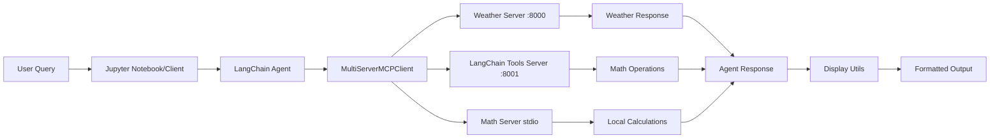

# Architecture Overview

## Components & Roles
| Component | Role | Notes |
|---|---|---|
| **LangChain Agent** | Orchestration & Reasoning | ReAct agent that coordinates tool calls and reasoning |
| **MultiServerMCPClient** | Connection Management | Manages HTTP connections to multiple MCP servers |
| **Weather Server** | External Service | Mock weather API via streamable-http transport (port 8000) |
| **LangChain Tools Server** | Tool Conversion | Converts LangChain tools to MCP format (port 8001) |
| **Math Server** | Local Operations | Basic math operations via stdio transport |
| **Display Utils** | Response Formatting | Debugging and formatting utilities for agent responses |
| **Jupyter Notebook** | Interactive Learning | Educational interface for hands-on experimentation |

## Data & Control Flow

## Graph (Nodes/Edges)
- **Nodes:** 
  - HumanMessage (user input)
  - AIMessage (agent reasoning)
  - ToolMessage (server responses)
- **Edges:** 
  - Sequential tool calls based on agent reasoning
  - Conditional routing based on tool selection
- **State:** 
  - Message history maintained in agent memory
  - Tool call results passed between operations
- **Human‑in‑the‑loop:** 
  - Interactive Jupyter notebook interface
  - Manual server startup and configuration
  - Real-time response display and debugging

## MCP & Tools
- **Servers:** 
  - Weather Server: `get_weather(location)` - Mock weather data
  - LangChain Tools Server: `add(a, b)`, `multiply(a, b)` - Math operations
  - Math Server: `add(a, b)`, `multiply(a, b)` - Direct math functions
- **Tools:** 
  - Dynamic tool discovery from multiple servers
  - Cross-server tool invocation capabilities
  - Tool conversion from LangChain format to MCP
- **Bindings:** 
  - Agent → MultiServerMCPClient → Individual MCP servers
  - Tool selection based on natural language understanding
  - Response aggregation from multiple sources

## Observability & Eval
- **Tracing:** 
  - Full message trace display with `display_agent_response()`
  - Tool call sequence visualization
  - Token usage metrics when available
- **Metrics:** 
  - Response time tracking per tool call
  - Success/failure rates for tool invocations
  - Cross-server communication latency
- **Testsets:** 
  - Integration test suite in `integration_test.py`
  - Multi-step reasoning validation
  - Cross-server tool invocation testing

## Decisions & Trade‑offs
- **Streamable-http vs stdio transport:** 
  - **Reason:** Streamable-http enables web-based deployment and easier debugging
  - **Alternative:** stdio for local-only scenarios
  - **Trade-off:** HTTP overhead vs deployment flexibility
- **MultiServerMCPClient vs individual connections:**
  - **Reason:** Centralized connection management and tool aggregation
  - **Alternative:** Direct server connections
  - **Trade-off:** Complexity vs scalability
- **Display utilities vs raw responses:**
  - **Reason:** Educational value and debugging capabilities
  - **Alternative:** Minimal output for production
  - **Trade-off:** Verbosity vs clarity

## Risks & Future Work
- **Risk:** Server connection failures - **Mitigation:** Connection pooling and retry logic
- **Risk:** Tool discovery failures - **Mitigation:** Graceful degradation and error handling
- **Risk:** Cross-server state management - **Mitigation:** Stateless tool design
- **Upgrade path:** 
  - Add authentication/authorization for production servers
  - Implement comprehensive error handling and retry mechanisms
  - Add monitoring and metrics collection
  - Expand to more complex tool ecosystems
  - Integrate with LangGraph state management for complex workflows
