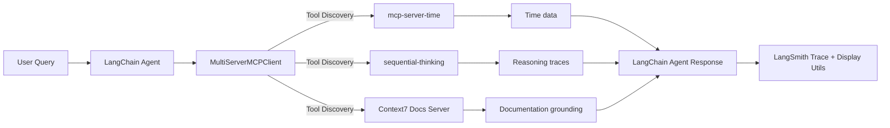

# Architecture Overview (Updated)

## Components & Roles

| Component                  | Role                         | Notes                                                                                       |
| -------------------------- | ---------------------------- | ------------------------------------------------------------------------------------------- |
| **MultiServerMCPClient**   | Tool Discovery & Aggregation | Discovers and merges tools from multiple MCP servers into a single namespace for agent use  |
| **LangChain create_agent** | Agent Orchestration          | Replaces LangGraph’s `create_react_agent`, unifying tool routing and reasoning logic        |
| **FastMCP Servers (HTTP)** | Remote Tool Services         | Demonstrate HTTP/SSE transport; used for examples like weather or math tools                |
| **StdIO MCP Servers**      | Local Tool Services          | Lightweight subprocesses offering time, reasoning, and documentation retrieval capabilities |
| **Display Utils**          | Response Formatting          | Formats agent responses for readable console or JSON output                                 |
| **LangSmith**              | Observability                | Captures and visualizes agent reasoning, tool usage, and latency metrics                    |

---

## MCP Server Roles (Clarified)

| MCP Server                            | Transport  | Purpose                                                                                                                                                                                                                      | Example Tools                            |
| ------------------------------------- | ---------- | ---------------------------------------------------------------------------------------------------------------------------------------------------------------------------------------------------------------------------- | ---------------------------------------- |
| **mcp-server-time**                   | StdIO      | Provides time and timezone utilities for scheduling and temporal reasoning.                                                                                                                                                  | `get_current_time`, `convert_time`       |
| **sequential-thinking**               | StdIO      | Enables structured, stepwise reasoning — a kind of reflective “scratchpad” tool for logical progression.                                                                                                                     | `sequentialthinking`, `plan_steps`       |
| **Context7 Documentation Server**     | StdIO      | Retrieves and grounds answers in **real documentation** (e.g., LangChain, LangGraph, LangSmith). Resolves library names via `resolve-library-id` and fetches authoritative code snippets or API docs via `get-library-docs`. | `resolve-library-id`, `get-library-docs` |
| *(Optional)* **FastMCP HTTP Servers** | HTTP / SSE | Extend with services like weather or arithmetic; demonstrate transport-agnostic design.                                                                                                                                      | `get_weather`, `add`, `multiply`         |

> 💡 **Key Distinction:** Context7 isn’t a calendar or task API — it’s a **DocsRAG-style documentation retriever** that grounds answers in versioned, source-linked documentation.

---

## Data & Control Flow

---

## Execution Pattern

* **Step 1:** Launches multiple MCP servers (time, reasoning, documentation) as subprocesses.
* **Step 2:** `MultiServerMCPClient` fetches each server’s tool manifest.
* **Step 3:** Tools are aggregated and bound to a unified LangChain agent (`create_agent`).
* **Step 4:** The agent dynamically selects tools to fulfill the user query.
* **Step 5:** LangSmith traces execution for observability.

---

## Version Context & Migration

| Aspect           | Before                           | After                          |
| ---------------- | -------------------------------- | ------------------------------ |
| Agent Creation   | `create_react_agent` (LangGraph) | `create_agent` (LangChain 1.x) |
| Tool Handling    | Manual, framework-specific       | Standardized via MCP protocol  |
| Architecture     | Graph-defined nodes              | Protocol-driven services       |
| Tool Integration | Custom interfaces                | Auto-discovered MCP manifests  |

---

## Decisions & Trade-offs

* **Adopted MCP** for universal tool protocol — language-agnostic, composable, scalable.
* **Mixed Transports (StdIO + HTTP)** for local vs remote execution.
* **Context7 Integration** ensures documentation-backed responses, preventing hallucination.
* **Sequential Thinking** adds reasoning transparency for better debugging.
* **LangSmith Observability** guarantees visibility into every decision path.

---

## Risks & Future Work

| Risk                                    | Mitigation                                             |
| --------------------------------------- | ------------------------------------------------------ |
| MCP server downtime or subprocess crash | Health checks and retry logic                          |
| Tool schema mismatch                    | Enforce versioned manifests and schema validation      |
| High latency from documentation queries | Add caching layer or vector index for Context7 results |
| Complexity scaling with server count    | Implement connection pooling and load balancing        |

---

## Summary Insight

The `integration_test_mcp_json.py` script demonstrates how **three small MCP servers** can collectively handle temporal logic, structured reasoning, and authoritative documentation retrieval. Context7 emerges as a **grounding layer for factual correctness**, bridging live documentation with agentic reasoning for reproducible, audit-ready responses.
