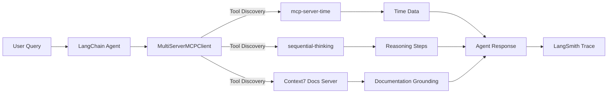

# 🧩 LangChain MCP Multi-Server Integration  
**From Tool Chaos to Context Clarity**  

> Built on [LangChain MCP Adapters](https://github.com/langchain-ai/langchain-mcp-adapters) • Powered by Context7 • Observed via LangSmith  

[]()  
[]()  
[]()  
[]()  
[]()  

---

## ⚡ TL;DR
This repo shows how to connect multiple **MCP (Model Context Protocol)** servers — including reasoning, time, and documentation tools — into a **single LangChain agent** that grounds responses in *real documentation*, not hallucinations.  

> 🧠 A reference pattern for AI engineers building **composable, observable, and context-aware agents**.

---

## 💡 Why This Matters
Modern AI systems juggle tools across languages and frameworks — leading to brittle integrations and opaque reasoning.  

**MCP changes that.**  
It’s a **protocol** for tool interoperability: agents can discover, invoke, and ground their reasoning using standard manifests, across any runtime.

**Benefits:**
- 🔍 Auto-discovers tools (no boilerplate integration)
- 🧠 Grounds responses in verified docs via **Context7**
- 🔬 Visualizes execution via **LangSmith**

---

## 🧭 System Overview

```
User → LangChain Agent → MultiServerMCPClient → MCP Servers → External APIs
```



### 🧩 MCP Server Roles
| Server | Purpose | Example Tools |
|--------|----------|---------------|
| **mcp-server-time** | Temporal reasoning & timezone ops | `get_current_time`, `convert_time` |
| **sequential-thinking** | Stepwise reasoning & planning | `sequentialthinking`, `plan_steps` |
| **Context7 Docs Server** | Documentation grounding across 40+ ecosystems (LangChain, OpenAI, Next.js, Redis, Hugging Face, etc.) | `resolve-library-id`, `get-library-docs` |

---

## 🏗 Architecture Pillars
| Pillar | Value | Example |
|--------|--------|----------|
| 🧱 **Standardization (MCP)** | Decouples agents from tool code | stdio / HTTP / SSE transports |
| 📚 **Grounding (Context7)** | Retrieves real, versioned docs | `/langchain/langchain/1.0.2` |
| 🔬 **Observability (LangSmith)** | Captures every call & latency | [Trace Example](https://smith.langchain.com/public/be69829b-ae12-4d0d-a735-ce53853d1b45/r) |

Together, they create agents that are **truthful, transparent, and reproducible**.

---

## 🚀 Demo Highlights
**File:** [`clients/integration_test_mcp_json.py`](../../clients/integration_test_mcp_json.py)  
A **112-line script** that orchestrates three MCP servers and executes grounded reasoning.  

### Flow
1. Launch MCP servers for time, reasoning, and docs  
2. Aggregate tools via `MultiServerMCPClient`  
3. Create agent using `create_agent()`  
4. Execute grounded prompts with full observability  

```python
response = await agent.ainvoke({
  "messages": "Provide guidance for migrating from LangGraph create_react_agent to LangChain create_agent (v1.0.2)."
})
```

**Result:** Context7 retrieves the correct LangChain v1 migration snippet — *no hallucination.*

---

## ⚙️ Quick Start

```bash
# Setup
uv venv --python 3.13 && source .venv/bin/activate
cp .env.example .env  # Add OPENAI_API_KEY, LANGSMITH_API_KEY

# Run the demo
python clients/integration_test_mcp_json.py
```

🧠 The script auto-spawns all servers and logs a LangSmith trace of the reasoning chain.

---

## 🧠 Stack Overview
| Layer | Component | Purpose |
|-------|------------|----------|
| LLM | GPT-4.1 | Reasoning engine |
| Orchestration | LangChain `create_agent` | Tool routing |
| Integration | `MultiServerMCPClient` | MCP discovery & aggregation |
| Tools | Time, Sequential Thinking, Context7 | Temporal + logical + factual context |
| Observability | LangSmith | Trace visualization |

---

## 🔍 Why Context7 Matters
- Surfaces **source-linked documentation** from 40+ ecosystems  
- Enables **version-specific grounding** for any framework  
- Bridges **reasoning with verified code**  
- Reduces hallucinations in real retrieval workflows  

> 🧩 *Context7 makes “agents that know what they know.”*

---

## 🔭 What’s Next
> The next frontier isn’t reasoning — it’s **context exchange** between agents.  

**Next Journey:**  
- 🤝 Explore **A2A (Agent-to-Agent)** interoperability  
- 🧩 Move beyond reasoning/action loops — toward persistent, contextual memory  
- 🔗 Evolve MCP for live, real-time context negotiation  

---

## 📚 References
- [LangChain MCP Adapters](https://github.com/langchain-ai/langchain-mcp-adapters)  
- [Model Context Protocol](https://modelcontextprotocol.io)  
- [LangSmith Tracing](https://smith.langchain.com)  
- [Context7 MCP Server](https://github.com/upstash/context7-mcp)  
- [Integration Output](docs/integration_test_mcp_json.md)  

---

**Project:** `langchain-mcp-multiserver-demo`  
**Purpose:** Educational reference for agent orchestration + documentation grounding  
**Python:** ≥ 3.13 | **License:** MIT  
